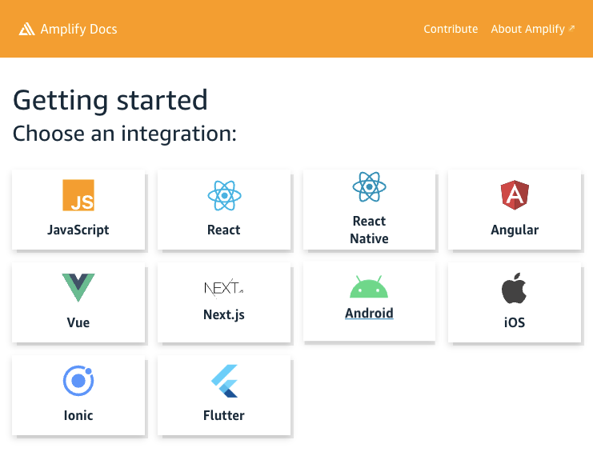

``` toc
```

## 何许人也
> So what does the future look like? - **ALL THE CODE YOU EVER WRITE IS BUSINESS LOGIC.**
> 
> *-- Amazon VP, CTO, Werner Vogels*

我总持有一个观点，一个健康的环境下，软件工程师不应该担心因为技术迭代而导致自己被淘汰。这不是什么“计算机从业者应该持续不断地学习”这种成词滥调，而是基于一个不言自明的事实：“新技术取代旧技术永远是因为新技术从根本上更易理解、更易上手”。“旧技术”复杂的原因是往往是其更贴近“本源”。而有了对于“本源”知识的理解，新技术的上手大部分也就是个Udemy上4个小时教程的事情。什么样的技术社区会去刻意追求复杂呢？或许没有，但我听闻一种断言是，在北美，律师、医生通过复杂性来提高入门门槛稳固体系。且不论这种断言的合理性，但软件工程，绝不属于这个行列。

而[AWS Amplify](https://aws.amazon.com/amplify/)则是这个观点的绝佳例证。AWS的[Serverless（无服务）](https://aws.amazon.com/serverless/)理念推行着[“业务逻辑”才是第一生产力的观点](https://betterprogramming.pub/all-the-code-you-will-ever-write-is-business-logic-2dc0acf47cef)，即作为AWS的使用者，你只需要写和你自己的业务相关的代码（比如网站页面，怎么支付订单）就可以了，不需要参与背后服务器的配置和维护。为此，它创造出了一大溜以“技术需求”为核心的服务。比如，我想让“key-value”形式的数据能有更多读取模式，我可以选择[DynamoDB](https://aws.amazon.com/dynamodb/)；我想处理流数据，可以选择[Kinesis](https://aws.amazon.com/kinesis/data-firehose/)；我需要一个消息队列，[SQS](https://aws.amazon.com/sqs/)是上乘之选。这种设计极大得提升了技术的复用性，一个**功能**，只需要合理组合、配置这些组件就可以了！太方便了！但这到极限了吗？Amplify的出现带领“业务至上”这一理念迈进了一步。

  

Amplify的使用者，关注“功能需求”，而非“技术需求”。我想存订单信息，里头要有订单编码、商品编码等，怎么存、存在哪儿，我不关心；我的网站需要用户登陆，怎么实现，我不关心；我要存商品图片，用什么技术我不关心，我只是想要存，然后取，存得放心，取得舒心……这些“功能需求”，对于Amplify，一行或者几行代码就可以实现！

怎么做到的呢？其实没什么魔法。简单讲，Amplify作为一个框架在背后帮你创建、组合并配置了那些技术组件，从而来实现常见的功能需求。其核心理念依然是增加组件的**复用性**，只不过此时，复用的是**功能**，而非技术。那么代价是什么呢？灵活性。有一定软件工程经验的人一定深有体会，“方便”和“灵活”永远是相斥的，使用“方便”的技术，就会时不时受到框架的限制；想要突破框架的限制，就必须拥抱复杂。

| 方便 | 灵活 |
| ---- | ---- |
| 使用[medium](https://medium.com/)写技术博客| 自己搭建博客网站 |
| 一个方法500行，想改哪里改哪里 | 合理抽象逻辑，增加代码可扩展性 |
| 看Udemy学习新技术 | 看官方文档学习新技术 |
| 订购家具 | 定做家具 |
| 买食材包，下锅一炒即刻上桌 | 思考菜单，购买食材，洗切后下锅 | 
| ... | ... |

这一章，将是一次“强势安利”，我将从不同角度介绍Amplify作为一种技术，为什么值得初入软件工程的新手了解和尝试。而作为这一节的总结，正如标题所说，Amplify是AWS这个“大型手游”的新手大礼包。相当合适的学习成本，你就能上手一众AWS的明星服务。从新手的角度来说，”大礼包“功能强大，能迅速拉开与不充值玩家实力的差距；而对于老玩家，”大礼包“也物超所值，你会发现总有一些小东西，用Amplify实现能做得很漂亮，很方便。而怎么拉开差距，怎么漂亮，怎么方便，且听我慢慢道来。

## 管中窥豹
Todo: 展示一个demo，演示Amplify如何加速一个项目的创建。

## 穷千里目
Todo: 简单从比较专业的角度介绍这个技术

## 求职建议
Todo: 展开
1. 这个开源项目是对于良好“技术品味”的初尝
2. 加速自己小想法的实现
3. 作为跳板，了解云服务，了解软件工程的关注点

## Drafting
[AWS Amplify](https://aws.amazon.com/amplify/)是亚马逊云2018年推出，且当下正在蓬勃发展的[开源项目](https://github.com/aws-amplify/amplify-js)。实质上是一个加速后端搭建并交互各种常见前端的**全栈**框架。它提供了命令行工具链，用以快速地创建后端设施并创建配置模版文件；它维护了一组前端库，方便各种前端与其创建的后端设施进行交互；它还原生提供了前端组件，方便一些常用需求（比如Authentication）的UI创建；最后，它还提供了项目的building和hosting的方案，一行命令部署上线，实现[CI/CD](https://www.redhat.com/en/topics/devops/what-is-ci-cd)。

作为一个[“后端即服务(BaaS)”](https://www.hitechnectar.com/blogs/top-14-backend-as-a-service-providers/)解决方案，Amplify支持的前端框架基本涵盖了我个人目力之所及。应用于Web，它提供了对React、Angular、Vue等的支持；应用于native，它也支持iOS、Andriod原生开发。除此以外，笔者执笔之时，已距离我过去的Amplify使用经验一年有余，再次打开[它的文档](https://docs.amplify.aws/start/)（下图），挠头于“当时确实只有4、5个选项吧。”开源社区其活跃的程度，可见一斑。



OK，[前端，你是有的。后端呢？我凭什么相信（停顿）你能剿了“全栈”？](https://zhuanlan.zhihu.com/p/382399510?ivk_sa=1024320u#:~:text=%E8%83%86%E5%AD%90%E4%BD%A0%E6%98%AF%E6%9C%89%E7%9A%84%EF%BC%8C%E6%9C%AC%E4%BA%8B%E5%91%A2%EF%BC%8C%E6%88%91%E5%87%AD%E4%BB%80%E4%B9%88%E7%9B%B8%E4%BF%A1%E4%BD%A0%E8%83%BD%E5%89%BF%E4%BA%86%E5%BC%A0%E9%BA%BB%E5%AD%90)。

Amplify对后端的管理是对于[AWS Infrastructure as Code(IoC)理念](https://docs.aws.amazon.com/whitepapers/latest/introduction-devops-aws/infrastructure-as-code.html)的一层从功能出发的抽象。简单说，当你上手AWS上眼花缭乱的服务的时候（下图），官方的教程通常是让你去AWS的控制台，也就是在网站上使用鼠标点击完成服务的创建和使用。而在实际工程中，一个应用需要你如同组合乐高积木一样组合多个AWS服务，其中涉及了大量的配置，自动化就显得格为重要。于是AWS提供了[Cloud Formation](https://aws.amazon.com/cloudformation/)，一种描述性的模版，来定义你需要的后端设施。你可以理解为你是乐高的设计师，你设计了一个房子，其中“地板”需要2*16的棕色积木，编号是“b-772”（我不玩乐高，我瞎编的），32个，逐行错开排拼在第一层。于是，你只需要制作说明书，把上面的信息记下，玩家（AWS）就能按照你的说明书（模版）搭建房子（应用）。用“模版（代码）”定义后端的设施，便是IoC。

  

Amplify则更进一步，它做的工作是“设计常见的模块说明书以方便其他乐高设计师”。依然用上面的例子，拥有了Amplify，你的说明书将可以从“32个棕色的b-277逐行错开拼在第一层”简化成“棕色地板:32*32的面积”。怎么拼，以及积木标号，都被抽象成了“地板”这个名词，随Amplify设计去吧，我们只关心这里需要的是地板就足够了！

有了这样的概念，我们便可以理解Amplify在后端的构建上实质是通过一定程度上牺牲灵活性，以换取便利度，方便新手入门AWS、或老手构建“常见需求”和”复杂项目的Demo“。幸运的是，AWS在设计Amplify的时候，事实上依然保留了相当的灵活性，Amplify应用可以作为一个组件，嵌在复杂的项目当中并[发挥一定作用](https://github.com/ZzzGin/cold-start-severless-backend-cdk)。当然那就是后话了。

正如这篇blog标题所讲的，Amplify是AWS这个手游的新手大礼包。相当合适的学习成本，你就能上手一众AWS的明星产品。从新手的角度来说，”大礼包“功能强大，能迅速拉开与不充值玩家实力的差距；而对于老玩家，”大礼包“也物超所值，你会发现总有一些小东西，用Amplify实现能做得很漂亮，很方便。而怎么拉开差距，怎么漂亮，怎么方便，且听我下面慢慢道来。


| 底层需求 | 比如 | Amplify提供方便了吗 | AWS提供了吗 |
| ----------- | ----------- | ----------- | ----------- |
| 数据存储 | 商品信息/博客文章/数据表怎么存？存在哪儿？| 是 | AppSync (DynamoDB/Aurora/AES) |
| 数据同步 | 微信聊天，我发消息如何**同步**给其他用户？| 是 | AppSync (DynamoDB) |
| 数据搜索 | 搜索框输入商品名，索引提供结果。怎么**索引**？| 是 | AppSync (AES) |
| 文件存储 | 用户上传的照片，怎么存？存在哪儿？| 是 | S3 |
| 逻辑控制与计算 | 我想自定义API功能 | 是 | Appsync/API Gateway (Lambda/ECS/EC2) |

| 中层需求 | 比如 | Amplify提供方便了吗 | AWS提供了吗 |
| ----------- | ------ | ----------- | ----------- |
| CI/CD 持续开发持续部署| 我push了代码，希望构建-测试-部署自动化 | 是 | CodeCommit, CodePipeline|
| IaC 设施即代码 | 我想自动化设施搭建 | 是 | CDK, CF |
| Availability 可用性 | 服务的提供会因为各种原因中断吗？ | 是 | AWS的立身之本 |
| Scalability 伸缩性 | 今天就10个用户，未来10万用户的时候我不希望重构 | 是 | 带无服务(Serverless)属性的服务都具备 |
| Durability 耐受性 | 墨菲定律，但是最坏情况下，我不希望数据丢失 | 是 | 带无服务(Serverless)属性的服务都具备 |
| 内部安全认证 | 只有我自己的Lambda才能调用我的ES | 否（据我所知） | 
| DNS与认证 | 用户如何抵达我的网站，并认证我的网站的真实性？| 部分 | Certificate Manager, Route 53 |

| 高层需求 | 比如 | Amplify提供方便了吗 | AWS Provider |
| ------- | -------- | -------- | -------- |
| 用户认证 | 用户注册、登陆 | 是 | Cognito |
| 用户行为分析 | 用户从哪儿来，到哪儿去，家里几口人，共有几亩地 | 是 | Pinpoint |
| 消息推送 | 你中奖了 | 是 | SNS, SMS, Pinpoint |
| 流数据 | 直播 | 否 | Firehose |
| ... | ... | ... | ...|
