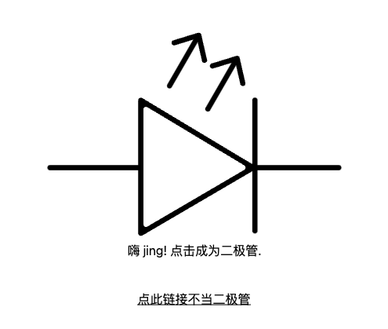
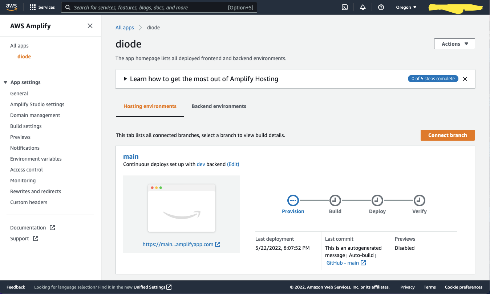

``` toc
```

## 何许人也
> So what does the future look like? - **ALL THE CODE YOU EVER WRITE IS BUSINESS LOGIC.**
> 
> *-- Amazon VP, CTO, Werner Vogels*

我总持有一个观点，一个健康的环境下，软件工程师不应该担心因为技术迭代而导致自己被淘汰。这不是什么“计算机从业者应该持续不断地学习”这种成词滥调，而是基于一个不言自明的事实：“新技术取代旧技术永远是因为新技术从根本上更易理解、更易上手”。“旧技术”的复杂性往往由于其更贴近“本源”。而有了对于“本源”知识的理解，新技术的上手大部分也就是个Udemy上4个小时教程的事情。什么样的技术社区会去刻意追求复杂呢？或许没有，但我听闻一种断言是，在北美，律师、医生通过复杂性来提高入门门槛稳固体系。且不论这种断言的合理性，但软件工程，绝不属于这个行列。

而[AWS Amplify](https://aws.amazon.com/amplify/)则是这个观点的绝佳例证。AWS的[Serverless（无服务）](https://aws.amazon.com/serverless/)理念推行着[“业务逻辑”才是第一生产力的观点](https://betterprogramming.pub/all-the-code-you-will-ever-write-is-business-logic-2dc0acf47cef)，即作为AWS的使用者，你只需要写和你自己的业务相关的代码（比如网站页面，怎么支付订单）就可以了，不需要参与背后服务器的配置和维护。为此，它创造出了一大溜以“技术需求”为核心的服务。比如（嘿，不要被下面的专有名词吓到，这是写作手法，先抑后扬、故意的：），我想让“key-value”形式的数据能有更多读取模式，我可以选择[DynamoDB](https://aws.amazon.com/dynamodb/)；我想处理流数据，可以选择[Kinesis](https://aws.amazon.com/kinesis/data-firehose/)；我需要一个消息队列，[SQS](https://aws.amazon.com/sqs/)是上乘之选。这种设计极大得提升了技术的复用性，一个**功能**，只需要合理组合、配置这些组件就可以了！太方便了！但是……这到极限了吗？Amplify在AWS领域带领“业务至上”这一理念迈进了一步。

  

Amplify的使用者，关注“功能需求”，而非“技术需求”。我想存订单信息，里头要有订单编码、商品编码等，怎么存、存在哪儿，我不关心；我的网站需要用户登陆，怎么实现，我不关心；我要存商品图片，用什么技术我不关心，我只是想要存，然后取，存得放心，取得舒心……这些“功能需求”，对于Amplify，一行或者几行代码就可以实现！

怎么做到的呢？其实没什么魔法。简单讲，Amplify作为一个框架在背后帮你创建、组合并配置了那些技术组件，来实现常见的功能需求。其核心理念依然是增加组件的**复用性**，只不过此时，复用的是**功能**，而非技术。那么代价是什么呢？灵活性。有一定软件工程经验的人一定深有体会，“方便”和“灵活”永远是相斥的，使用“方便”的技术，就会时不时受到框架的限制；想要突破框架的限制，就必须拥抱复杂。

| 方便 | 灵活 |
| ---- | ---- |
| 使用[Medium](https://medium.com/)平台写技术博客| 自己搭建博客网站 |
| 一个方法500行，想改哪里改哪里 | 合理抽象逻辑，增加代码可扩展性 |
| 看Udemy学习新技术 | 看官方文档学习新技术 |
| 订购家具 | 订做家具 |
| 买食材包，下锅热炒即刻上桌 | 思考菜单，购买食材，洗切后下锅 | 
| ... | ... |

这一章，将是一次“强势安利”，我将介绍Amplify作为一种技术，为什么值得所有软件工程从业者工具箱中的一部分。作为这一节的总结，正如标题所说，Amplify是AWS这个“大型手游”的新手大礼包。相当合适的学习成本，你就能上手一众AWS的明星服务。从新手的角度来说，”大礼包“功能强大，能迅速拉开与不充值玩家实力的差距；而对于老玩家，”大礼包“也物超所值，你会发现总有一些小东西，用Amplify实现能做得很漂亮，很方便。而怎么拉开差距，怎么漂亮，怎么方便，且跟随我一齐探索。

## 管中窥豹
多说无益，show me the code。

我们将完成一个网页应用——[Diode](https://en.wikipedia.org/wiki/Diode)，向默默地为这个世界的运转做贡献的二极管们致敬。以下是这个网页应用的需求列表：
1. 每个人都可以当二极管，一人一号，互不干扰；
2. 二极管有且仅有两个状态，on/off，随时切换；
3. 同个账号的二极管在多设备上实时同步，多屏协同；
4. 部署至因特网，面向全球二极管，有足够的扩容性；
5. 快捷流水线部署，push完代码快速看到结果，做最敏捷的二极管；
6. 自定义域名，SSL证书签名，成为互相信任的二极管。

这个是最后的结果：[diode.zzzgin.com](https://diode.zzzgin.com/)。源码：[github.com/ZzzGin/diode](https://github.com/ZzzGin/diode)。

**Demo步骤：**
1. 前往：https://diode.zzzgin.com/;


2. 创建账号，可使用这类[10分钟临时邮箱](https://10minutemail.com/);
3. 登陆成为二极管！


4. 点击页面，切换二极管通断；


5. 使用其他设备点击相同链接，同账号登陆，点击页面切换二极管通断，可以观察到多屏协同；
6. 点击“点此链接不当二极管”退出登陆，不当二极管。

**暂停，我们想一想这个app背后的技术需求：**
1. 前端应用我们可以使用React框架实现。可能需要host在一台服务器上，如果未来流量增加，可能需要多台服务器并实现负载均衡。当然这里可以使用云服务提供商的存储服务，比如S3，然后用Cloudfront实现CDN加速；
2. 后端如果不知道一些技术，设计可能会比较复杂了。首先，这是一个实时的状态更新，websocket server要维护链接表，Oh no，如果流量上去了，怎么同步多服务器的链接表呢？其实这类数据同步可以使用AWS的AppSync，GCP的Firebase也有这种功能。
3. 用户还有登陆系统，关系数据库看起来绕不过去了。哦对不用，AWS有Cognito可以直接提供API来实现用户登陆、账号创建！用它！
4. 还要实现“CI/CD（持续集成/持续交付）”，还要搞个部署流水线？AWS CodeCommit和Pipeline得整上。要不就去Github找找插件。
5. 还要域名和证书？行吧，Route 53可以购买域名；AWS Certificate Manager可以解决证书。

**设计齐活，开始整活儿！且慢，让我们看看，一个Amplify开发者怎么看待这个应用：**
1. 前端用React写吧。
2. 需要用户登陆，看起来需要导入一个Amplify Auth组件；
3. 多屏同步，说明需要个API来同步不同设备的更新，那要有一个Amplify API组件；
4. 要域名是吧，Route 53买一个域名，然后鼠标在管理页面上设置一下就行；
5. 什么？你问交付流水线？这个不是Apmlify自带的功能吗？

从上面系统设计的角度来说，Amplify开发者已经先人一步了。Amplify开发者思考实现的思路是“需要什么功能”-“对应什么Amplify提供的组件”。反之，自己造轮子的开发者的思路是“这个功能背后的技术需求”-“对应的技术”-“有没有技术陷阱，有没有更好的选项”。要知道，技术是有盲点的，如果你不知道某个技术，你还是要花时间和同事聊天、或者网上找资料去学。而Amplify，已经为你做好了技术选型，配置得当，并且文档就在那里，一个组件对应一个功能，你看与不看，它都在那里。

**下面，是这个应用的开发流程。让我们吹毛求疵一点，鉴于之前我提到“Amplify的设计目标是仅写业务逻辑”，我们来看看使用Amplify实现这个应用，要写多少行非业务代码。**

> 注意，以下步骤并不是设计给读者按照步骤操作的，如果想要实际上手尝试使用Amplify开发应用，请看我的这个blog：[Sandbox: Diode - An Amplify Hands-on Project](/blogs/detailed-steps-to-setup-diode)，这里有这个应用非常详细的开发过程。

1. Github上新建一个空白项目，clone到本地；
2. `npx create-react-app .`创建一个React应用；`npm i -g @aws-amplify/cli`安装Amplify的CLI工具链（用于第三步）；
3. 使用Amplify命令行工具运行`amplify init`初始化，其间会以一问一答的形式给你选项让你对这个项目做一定的配置；
4. 使用AMplify命令行工具运行`amplify add api`添加一个GraphQL API，同样，一问一答配置这个API；
5. 到此为止，一行代码没写呢！接下来，更随着Amplify的引导，我们要写7行代码定义数据库的数据结构：
```graphql
type Diode # 要存的数据类型定义名为diode
  @model # 声明这是一个数据结构，下面的每个field都是二极管的数据组成
  @auth(rules: [{ allow: owner }]) { # 这个数据模型只有登陆的用户是所有者的时候才可以被使用
  id: ID! # ID，感叹号指必须存在的值
  state: Boolean! # 通/断布尔值表示“二极管”当前的状态
  owner: String # 所有者用户名
}
```
6. 数据定义好了，命令行运行`amplify push`部署后端！
7. 通过NPM安装依赖包，终于可以写代码了…… `index.js`里添加代码：
```javascript
Amplify.configure(aws_exports);
// Amplify问你自动生成了设置文件`./aws-exports.js`，需要在前端import这个配置

const root = ReactDOM.createRoot(document.getElementById('root')); // React框架相关代码
root.render( // React框架相关代码
  <Authenticator>  // 一行代码调用Amplify提供的库，实现所有和用户登陆相关功能，比如用户登陆、创建账号、忘记密码等等
    {({ signOut, user }) => ( // 将退出登陆回调函数和用户名传入App组件
      <App signOut={signOut} user={user}/>  // 调用我们将要写的组件
    )}
  </Authenticator> // 好吧，两行！
);
```
8. 接着就是实现前端页面了，改动位于`App.js`，与`App.css`：
```javascript
const [turnedOn, setTurnedOn] = useState({ id: "", state: true });

const onClick = () => {
  API.graphql(graphqlOperation(updateDiode, {
    input: {id: turnedOn.id, state: !turnedOn.state}
  }))
}
```
上述代码创建一个新的React state用于保存二极管的id和当前通断状态。在React的帮助下，当state发生变化的时候，页面上显示这个state内容的地方也会发生变化。这里还创建了一个`onClick`函数来切换二极管的通断，注意到，这里通过调用Amplify提供的`API.graphql`函数来更新数据库中的值。这一操作中`graphqlOperation`起到一个“口袋”的作用，把`updateDiode`——在第6步中创建的GraphQL语句模版，与`input`拼装在一起，传给`API.graphql`，实现对数据库的写入。

``` javascript
API.graphql(graphqlOperation(listDiodes, {})).then(({ data }) => {
  const diodes = data.listDiodes.items
  if (diodes.length === 0) { 
    API.graphql(graphqlOperation(createDiode, {input: {state: true} })).then(({ data }) => {
      setTurnedOn({
        id: data.createDiode.id,
        state: data.createDiode.state
      });
    })
    return;
  }

  setTurnedOn({
    id: diodes[0].id,
    state:diodes[0].state
  });
});
```
上面的部分将会在页面加载的时候运行。总体逻辑就是先尝试从数据库中读取该用户的二极管的通断状态和id；如果不存在，说明是该用户的首次登陆，那么通过`createDiode`来创建一个二极管；如果存在，则将读取的id和状态写入state，正如我们之前所说，React前端框架会在state值发生变化的时候更新页面的元素，从而改变网页的黑白背景色。

```javascript
Auth.currentAuthenticatedUser().then((data) => {
  API.graphql(graphqlOperation(onUpdateDiode, { owner: data.username })).subscribe({
    next: data => {
      setTurnedOn({
        id: data.value.data.onUpdateDiode.id,
        state: data.value.data.onUpdateDiode.state
      });
    }
  })
});
```
上面这一部分也是在页面初始化的时候调用，我们会通过相似的方式调用`onUpdateDiode`，这种带`on`的API调用会建立一个持续的链接，当数据库内的数据发生更新的时候，会主动把更新的值**推送**给我们的应用。这种主动推送的机制便可以实现多设备间的状态同步。

如果你是第一次阅读React代码没有头绪，没关系，请参考下面的Sequence Diagram。


9. 好了，说来你可能不信，但是我们的二极管应用确实已经完成了！包括了css，一共写了90行代码不到！此时可以`npm run start`在本地测试代码。
10. 要部署这个代码，只需要commit后push到Github。然后前往AWS Amplify页面设置到App代码的branch即可。部署流水线也自动创建：


11. 流水线可以自动化你新版本部署，你今后对应用的更新，push到Github，代码就会自动编译并部署到云端；
12. 最后一步，应用当前使用Amplify的默认域名[main.d3pq3bg1mrhpp5.amplifyapp.com](https://main.d3pq3bg1mrhpp5.amplifyapp.com/) 。通过鼠标点击网页上的“设置”选择自己的域名，Amplify会为你自动生成证书。等待证书配置完成后，https://diode.zzzgin.com/ 正式上线！

回顾一下上面的步骤，没有对于技术选择的纠结，没有配置的烦躁，一切行云如流水。回头看一下我们写的代码，**没有一行**是与业务逻辑不相关的，透彻！接下来，让我们再走近一些，看看这些步骤后面都发生了什么。

## 穷千里目：Amplify如何帮助开发者实现效率提升
你可能会有疑问，怎么定义“业务逻辑相关代码”和“不相关代码”呢？这种简单的应用，难道不就是90行代码的量吗？“业务逻辑”比较好定义，即“与业务相关的代码”。比如我是咖啡店店长，我的网上订单应用需要用户选择咖啡豆的种类，这个就是我咖啡店业务的代码。用diode举例，我在数据库里存的“二极管”的数据类型、以及UI的设计与功能，就是应用的“业务”。

而“与业务逻辑不相关的代码”，具体来说，有三类：
1. 后端设施搭建需要的代码；
2. 前后端交互需要的框架代码；
3. DevOps设施需要的代码。
容我喝口水，慢慢道来：

### 1. 后端设施搭建
任何一个工程意义上的Web应用，后端都是**一组**服务器（host）有机结合的整体。各个服务器，配置不相同，需要安装的软件不相同，启动也有先后顺序。你不能指望这些东西都以文本的形式存在然后通过人手动操作，速度慢是一方面，关键是“手动”便意味着错误，这是不可避免的。于是，我们需要写配置代码来让编排自动化。

当后端的对象是单纯的服务器的时候，我们有很多工具，比如Docker+K8s来做这些工作。而AWS平台上的大部分服务，都不需要用户直接接触服务器，但依然逃不过配置这些服务的宿命。AWS开发者使用[CDK](https://aws.amazon.com/cdk/)或者[Cloud Formation](https://aws.amazon.com/cloudformation/)来配置和组合AWS组件，编排后端设施的自动创建，一如Lego说明书一样。
  

那么，Amplify帮我们制作了Lego说明书吗？是的！在你前一节运行`amplify init`和`amplify push`的时候，Amplfiy框架为你创建了一大堆配置文件(json格式的Cloud Formation，位于amplify目录下的“current-cloud-backend/awscloudformation/”中)，并且将这些文件上传到了AWS让它按图索骥。它具体帮你做了多少东西呢？以diode为例，一共创建了4个配置文件，共1600余行的json，2、30个组件，其中包括了数据库(DynamoDB)、GraphQL API（AppSync）、用户注册登陆管理服务（Cognito）以及很多与权限控制相关的组件（IAM Role/Policy）。

> 有一句话说得好，“如果你觉得岁月静好，一定是有人为你负重前行”。Amplify就在为你负重前行，听我说，谢谢你……

### 2. 前后端交互
这个很好理解，前端和后端的联系基于“合约”，或者叫API。这个合约的代码实现也是与业务逻辑不相关的部分。比如说，后端为了安全性，需要了解发出请求的一方是否是被认可；又或者后端在请求客户端的时候要根据用户ID来仅返回该用户的记录。这些，是后端需要实现的“框架”级别的功能。而前端，需要构建符合后端要求的请求，需要配置“怎么找到后端”，还需要考虑如何处理异常等等。

Amplify在这一点做了很多作为一个框架该做的事，比如提供方便的内置方法和组件，减少我们调用后端功能的代码量。用上面的示例代码举例：`API.graphql()`，`<Authenticator />`, `Auth.currentAuthenticatedUser()`都是Amplify的前端框架的内置方法。

除此以外，实例中Amplify还有一处值得提及的贡献：示例代码中的`updateDiode`，`createDiode`，`onUpdateDiode`，实际上都是Amplify根据我们在第5步定义的数据模型自动创建的GraphQL模版。如果你前往[这里](https://github.com/ZzzGin/diode/blob/main/src/graphql/mutations.js#L18)可以看到，`updateDiode`其实是一个string类型，定义后端期待的数据格式。这里如果读者是第一次接触GraphQL，我不去深入GraphQL这种API（和它同级的名词有“Rest”和“RPC”，可以观看[这个视频](https://www.youtube.com/watch?v=hkXzsB8D_mo)了解更多）的具体细节，你只需要知道Amplify想要实现的目标是，对于常见增删改查需求，Amplify开发者完全不需要了解GraphQL，使用自动生成的模版，就可以实现对GraphQL API的调用。

### 3. DevOps设施
对于新软件工程师来说，可能对“DevOps”没有什么概念。具体来说，这是软件工程师的一种工作类型。过去，软件工程师有架构、开发、测试、运维这样的分类，但是在生产实践中，人们逐渐发现这样的所谓“分工合作”显著增加了不同类型工作人员的沟通成本。比如说，作为一个架构师，我要费力给“开发”解释这样架构的原因；作为“开发”，我完成了代码，要和“测试”沟通这个功能，然后皮球就被踢给了“测试”；至于以后功能上线了，那出了问题就是“运维”伤脑筋了，如果搞不定，还是需要“开发”和“测试”协同解决……听起来就很低效，一如[《人月神话》](https://zh.wikipedia.org/zh-cn/%E4%BA%BA%E6%9C%88%E7%A5%9E%E8%AF%9D)中的“[焦油坑](https://zhuanlan.zhihu.com/p/121105924)”。

于是现在，至少在Amazon这种大型科技公司，DevOps这种工作类型成为了趋势，即软件工程师需要熟悉并做所有事情！听起来好像更低效了？不。Amazon设计了一整套DevOps系统流程，来让一人司多职成了可能，包括臭名昭著的oncall制度。这是好是坏呢？从软件工程的角度，我认为利大于弊，因为这种制度无形中增加了开发者对于自己代码的责任意识；从个人的角度呢？我不好说，一方面，了解更多总是对于自己能力的提升；但是不可否认的是，软件工程师做的事变多了，单个需求的开发周期变长了。

但是无论如何，这种形式已经在大型公司中成为趋势，适应它、从中汲取力量、然后改进它，总是最有意义的。

言归正传，Amplify提供了这么一套DevOps设施，方便管理一个团队对于项目的开发过程：比如将Github中托管的代码编译、部署、测试一条龙的流水线；比如对于Pull Request的Preview功能，方便开源团队观察PR的效果。另一方面，从运维的角度来说，Amplify使用的技术大多以“无服务”作为卖点。这样的好处是，你只需要关注功能的“配置”，而不用关心背后服务器纷繁复杂的维护；而且，“无服务”的核心价值是扩容性，你的代码在10个用户的时候能跑通，10万的用户的时候依然可以从容应对。当然，“无服务”的坏处也是有的，比如，价格相比会比较昂贵。

> 我本将心向明月，奈何明月照沟渠。有人要DevOps，Amplify给了，你用不用，那是另一回事了。

## 初极狭，才通人：对于“为什么要推荐它”的回应
实现“写一个应用”这种需求的技术和框架，在这个时代，那可真是海了去了。“所以你鼓吹Amplify是什么居心？是恰了饭，还是单纯的亚麻吹？什么屌框架我听都没听说过！”——且听我从两个方面为自己狡辩：

### 一、技术不是终点
不了解软件开发的人往往有一种误解，认为软件从业者是靠“技术”吃饭的。他们会说“你用的这种语言，这种框架**落伍**了”；他们会说“后端开发的困难度大于前端，所以从事后端更加有**保障**”；他们会在简历中用大段篇幅一一罗列自己接触过的技术名词。我以为，和所有所谓“技术工种”一样，软件工程的核心诉求是“解决问题”。习惯了软件工程工作模式的人会这么说“你要解决的这个问题，已经**落伍**了”，“前端后端都有其要解决的问题，从复杂度上来说不分伯仲”，简历上罗列的是解决**过**的问题和如何解决问题。

至于解决问题过程中使用的工具、技术、框架、语言、过程或者随便叫什么，根本不重要，那些是你解决了这一类问题时获得的奖励，奖励你在未来面对相同问题时抽刀断水。

基于这一事实，我们来看看Amplify能帮以下两类人解决什么样问题：

#### 1. 新从事软件工程的人
* 不可否认的一点，**充实简历**，但绝不是简单列一个单词——Amplify。
  * 这种（相对）小众的框架，别说在整个计算机行业，就算在亚马逊内部，知道的工程师都不占大多数。我在亚马逊工作3年，几乎没有见过内部有什么东西使用Amplify实现的。因此不要指望用这个技术的名头过简历关（事实上，很少有技术能通过名字能让你过北美软件工程师招牌的简历关，除非是极为小众且困难的技术；但相对的，小众的技术面对的是小众的市场）。
  * Amplify提供了**一整套**应用开发的解决方案。它在你想要实现自己的灵感的时候能给你提供最基础的**方向感**。于是，你的灵感能够落实，以充实简历。
  * Amplify针对常见的需求提供了**简便**的开发流程。我在上一章具体介绍了这一点，谁不喜欢简单呢？于是，你的灵感能**更快地**被实现，以充实简历。
* 更进一步，Amplify是你接触AWS云服务的最佳跳板。
  * Amplify在上一章介绍的各种功能，其实背后都是AWS纷繁复杂的各种服务互相配合搭建出来的。于是，使用Amplify时“知其所以然”的过程，是一个**从目标向本源**搜索的体验。就我个人经验而言，这比单独去了解各个服务然后对于这些东西能实现什么功能一头雾水有意思多了。
  * 即便我不说，相信读者也明白AWS在云服务提供商中的地位。回到“充实简历”这一点，就算为了填充简历上的空隙要列举技术名，Amplify也可能为你提供一长溜一听就很酷的技术名——DynamoDB！AppSync！OpenSearch！Aurora！S3！Lambda！唇齿间说出来，就够时髦！
  * 光知道这些时髦名字是干什么的、怎么用的、特性是什么，已经是对于新手技术的一次巨大提升。如果你再花一些功夫去了解这些服务从原理上的技术实现，从而了解系统设计方面的知识，那Amplify于你可以等同于九阴真经之于郭靖的存在了。总之，即便还无法那么深入，Amplify至少给你提供了研究的方向。
* 对于优秀“技术品味”的初尝。
  * 相比于上两点，这一点显得比较抽象了，并且也仅是我个人的看法。Amplify向初入软件工程的你，介绍了一种“技术品味”比较优秀的开发工作流，比如创建、管理、开发、测试、部署一个项目的流程。这种工作流虽然不一定和你以后上班一模一样，但是概念上大概率有相似之处。因此，了解Amplify可以让你预先体验企业的开发环境，这既可以用于自我预热，又可以自我评估。

#### 2. 软件工程从业者
* 个人浅见，Amplify好处是提供了一套“完整”的应用开发流程，坏处亦然。它“过于”完整，提供了“过多”方便，以至于在灵活性上被降级了。我前面提到了，在亚马逊内部，或许我个人见识短浅，但是很少见到工程师讨论Amplify。原因正是它简化了太多在企业应用中需要复杂的部分。
  * 然而，Amplify是我在工作中接触过的最适合做prototype的工具。我曾在团队的Hackthon中使用Amplify写了一个帮助团队debug的小工具，开发很迅速，效果很抢眼。
  * 因此我希望同为软件工程从业者的你，如果你的工作也与AWS有交集，Amplify绝对是不可多得的瑞士军刀。你或许不能用它做木工活，但帮你完成一些小东西是不在话下的。

### 二、尽我所能，提升Amplify社区影响力
Amplify是有非常多的竞争者的。倒不是无脑吹，但是Amplify在一些情况下是非常有优势的选项，但有的时候却单纯因为“不够熟悉”而被放弃。前面提到，我是用Amplify在工作中获得过方便，所以我也想用力所能及的方式，回馈这个社区，增强它的影响力。

## 复行数十步：技术摘要

## 也为外人道也：缺陷
1. 中国区功能缺失
2. 学习曲线略陡峭
3. 活跃的开源社区、快速迭代带来的麻烦
4. 价格劣势
5. 有扩展性，但也有极限


## Drafting
[AWS Amplify](https://aws.amazon.com/amplify/)是亚马逊云2018年推出，且当下正在蓬勃发展的[开源项目](https://github.com/aws-amplify/amplify-js)。实质上是一个加速后端搭建并交互各种常见前端的**全栈**框架。它提供了命令行工具链，用以快速地创建后端设施并创建配置模版文件；它维护了一组前端库，方便各种前端与其创建的后端设施进行交互；它还原生提供了前端组件，方便一些常用需求（比如Authentication）的UI创建；最后，它还提供了项目的building和hosting的方案，一行命令部署上线，实现[CI/CD](https://www.redhat.com/en/topics/devops/what-is-ci-cd)。

作为一个[“后端即服务(BaaS)”](https://www.hitechnectar.com/blogs/top-14-backend-as-a-service-providers/)解决方案，Amplify支持的前端框架基本涵盖了我个人目力之所及。应用于Web，它提供了对React、Angular、Vue等的支持；应用于native，它也支持iOS、Andriod原生开发。除此以外，笔者执笔之时，已距离我过去的Amplify使用经验一年有余，再次打开[它的文档](https://docs.amplify.aws/start/)（下图），挠头于“当时确实只有4、5个选项吧。”开源社区其活跃的程度，可见一斑。


OK，[前端，你是有的。后端呢？我凭什么相信（停顿）你能剿了“全栈”？](https://zhuanlan.zhihu.com/p/382399510?ivk_sa=1024320u#:~:text=%E8%83%86%E5%AD%90%E4%BD%A0%E6%98%AF%E6%9C%89%E7%9A%84%EF%BC%8C%E6%9C%AC%E4%BA%8B%E5%91%A2%EF%BC%8C%E6%88%91%E5%87%AD%E4%BB%80%E4%B9%88%E7%9B%B8%E4%BF%A1%E4%BD%A0%E8%83%BD%E5%89%BF%E4%BA%86%E5%BC%A0%E9%BA%BB%E5%AD%90)。

Amplify对后端的管理是对于[AWS Infrastructure as Code(IoC)理念](https://docs.aws.amazon.com/whitepapers/latest/introduction-devops-aws/infrastructure-as-code.html)的一层从功能出发的抽象。简单说，当你上手AWS上眼花缭乱的服务的时候（下图），官方的教程通常是让你去AWS的控制台，也就是在网站上使用鼠标点击完成服务的创建和使用。而在实际工程中，一个应用需要你如同组合乐高积木一样组合多个AWS服务，其中涉及了大量的配置，自动化就显得格为重要。于是AWS提供了[Cloud Formation](https://aws.amazon.com/cloudformation/)，一种描述性的模版，来定义你需要的后端设施。你可以理解为你是乐高的设计师，你设计了一个房子，其中“地板”需要2*16的棕色积木，编号是“b-772”（我不玩乐高，我瞎编的），32个，逐行错开排拼在第一层。于是，你只需要制作说明书，把上面的信息记下，玩家（AWS）就能按照你的说明书（模版）搭建房子（应用）。用“模版（代码）”定义后端的设施，便是IoC。

  

Amplify则更进一步，它做的工作是“设计常见的模块说明书以方便其他乐高设计师”。依然用上面的例子，拥有了Amplify，你的说明书将可以从“32个棕色的b-277逐行错开拼在第一层”简化成“棕色地板:32*32的面积”。怎么拼，以及积木标号，都被抽象成了“地板”这个名词，随Amplify设计去吧，我们只关心这里需要的是地板就足够了！

有了这样的概念，我们便可以理解Amplify在后端的构建上实质是通过一定程度上牺牲灵活性，以换取便利度，方便新手入门AWS、或老手构建“常见需求”和”复杂项目的Demo“。幸运的是，AWS在设计Amplify的时候，事实上依然保留了相当的灵活性，Amplify应用可以作为一个组件，嵌在复杂的项目当中并[发挥一定作用](https://github.com/ZzzGin/cold-start-severless-backend-cdk)。当然那就是后话了。

正如这篇blog标题所讲的，Amplify是AWS这个手游的新手大礼包。相当合适的学习成本，你就能上手一众AWS的明星产品。从新手的角度来说，”大礼包“功能强大，能迅速拉开与不充值玩家实力的差距；而对于老玩家，”大礼包“也物超所值，你会发现总有一些小东西，用Amplify实现能做得很漂亮，很方便。而怎么拉开差距，怎么漂亮，怎么方便，且听我下面慢慢道来。


| 底层需求 | 比如 | Amplify提供方便了吗 | AWS提供了吗 |
| ----------- | ----------- | ----------- | ----------- |
| 数据存储 | 商品信息/博客文章/数据表怎么存？存在哪儿？| 是 | AppSync (DynamoDB/Aurora/AES) |
| 数据同步 | 微信聊天，我发消息如何**同步**给其他用户？| 是 | AppSync (DynamoDB) |
| 数据搜索 | 搜索框输入商品名，索引提供结果。怎么**索引**？| 是 | AppSync (AES) |
| 文件存储 | 用户上传的照片，怎么存？存在哪儿？| 是 | S3 |
| 逻辑控制与计算 | 我想自定义API功能 | 是 | Appsync/API Gateway (Lambda/ECS/EC2) |

| 中层需求 | 比如 | Amplify提供方便了吗 | AWS提供了吗 |
| ----------- | ------ | ----------- | ----------- |
| CI/CD 持续开发持续部署| 我push了代码，希望构建-测试-部署自动化 | 是 | CodeCommit, CodePipeline|
| IaC 设施即代码 | 我想自动化设施搭建 | 是 | CDK, CF |
| Availability 可用性 | 服务的提供会因为各种原因中断吗？ | 是 | AWS的立身之本 |
| Scalability 伸缩性 | 今天就10个用户，未来10万用户的时候我不希望重构 | 是 | 带无服务(Serverless)属性的服务都具备 |
| Durability 耐受性 | 墨菲定律，但是最坏情况下，我不希望数据丢失 | 是 | 带无服务(Serverless)属性的服务都具备 |
| 内部安全认证 | 只有我自己的Lambda才能调用我的ES | 否（据我所知） | 
| DNS与认证 | 用户如何抵达我的网站，并认证我的网站的真实性？| 部分 | Certificate Manager, Route 53 |

| 高层需求 | 比如 | Amplify提供方便了吗 | AWS Provider |
| ------- | -------- | -------- | -------- |
| 用户认证 | 用户注册、登陆 | 是 | Cognito |
| 用户行为分析 | 用户从哪儿来，到哪儿去，家里几口人，共有几亩地 | 是 | Pinpoint |
| 消息推送 | 你中奖了 | 是 | SNS, SMS, Pinpoint |
| 流数据 | 直播 | 否 | Firehose |
| ... | ... | ... | ...|

## More readings
1. [awesome-aws-amplify](https://github.com/dabit3/awesome-aws-amplify)
2. 