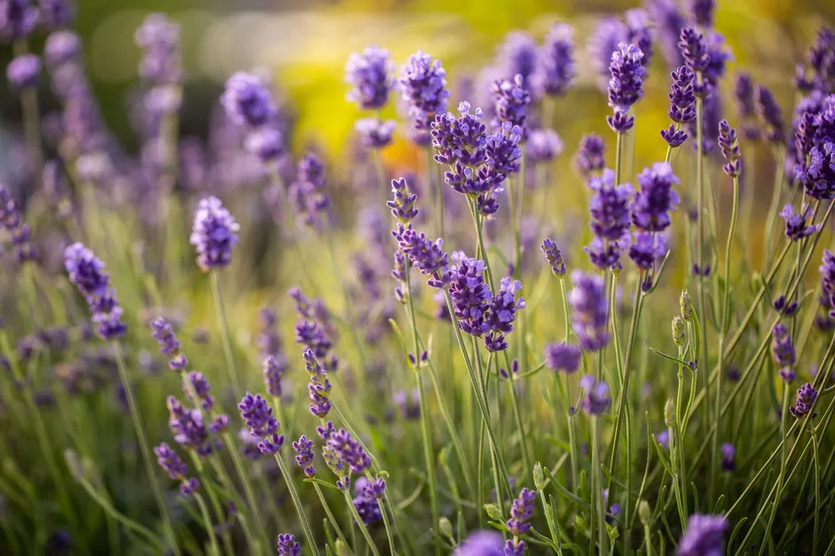

> Translated from: [How to Grow and Care for English Lavender](https://www.thespruce.com/english-lavender-plants-2130856) by: [DAVID BEAULIEU](https://www.thespruce.com/david-beaulieu-2130754)

## 总览
| 项目 | 属性 |
| --- | -- |
| 通用名称 | English lavender, true lavender, common lavender |
| 植物学名称 | *Lavandula angustifolia* |
| 科属 | *Lamiaceae (mint)* |
| 植物类型 | Herbaceous flowering perennial 多年生草本开花 |
| 成熟尺寸 | 2-3 ft. tall, 2-4 ft. wide |
| 日照 | 全日 | 
| 土壤类别 | 沙质，沙砾，干燥至中等，排水良好 | 
| 土壤酸碱度 | 中性（6.7-7.3）| 
| 绽放时间 | 盛夏 | 
| 花色 | 深紫色或浅紫色是最常见的，但混合颜色也有淡紫色、紫蓝色、白色和粉红色 | 
| 耐寒区 | 5-8 ([USDA](https://planthardiness.ars.usda.gov/))| 
| 原生地区 | 地中海 | 
| 毒理 | 动物致毒 | 

## 细节
英国薰衣草(Lavandula angustifolia)具有芳香的叶子和芬芳的花穗，通常被认为是一种草本植物。但它实际上是一种具有半木质生长习性的多年生草本植物。它常被种植晒干以制作香包，也可用于制作睡眠芳香疗法的油。它也是一种有吸引力的园林植物，在春末到初夏出现鲜艳的紫色花朵。

薰衣草从在**春季**开始，可与其他春季小植物间距为一到三英尺种植。这种植物通常长到两到三英尺高，方形茎上有狭窄的灰绿色叶子（长一点超过两英寸）。在温暖的气候中，叶子可能是常绿的。在温暖的生长季节，它的生长速度会比较缓慢，因为它的木质基部会逐渐生长，新茎也会多生长几英寸。这种芳香植物以驱赶鹿、驱赶猫而闻名，**且对宠物有毒**。

### 光
在**充足的阳光**下种植英国薰衣草。阴暗的地方通常会导致植物变得长腿产生更少的花朵。然而，在非常炎热的气候中，需要在下午最为炎热的时候做一些遮蔽。

### 土壤
英国薰衣草必须种植在**相对沙质或沙质但排水良好的土壤**中。非常腐殖质、潮湿的土壤经常导致根腐病。努力寻找与其本土地中海地区相似的土壤，那里的土壤干燥且贫瘠。在土壤中添加有机物质不仅没有必要，而且可能会导致问题。

### 水
幼苗应在第一周每隔一天浇水一次。一旦建立，它们就非常耐旱，不喜欢太多的水，这可能会抑制它们开花的能力。根据您的气候，大约每周给成熟的植物浇水一次，在花蕾形成后将频率增加到大约每四天，以促进健康的收获。

### 温度和湿度
这些植物在温暖但不闷热的条件下生长最好。他们喜欢相对干燥的气候，对高湿度耐受不佳。

### 肥料
英国薰衣草通常不需要肥料。施肥可能会抑制其开花能力。