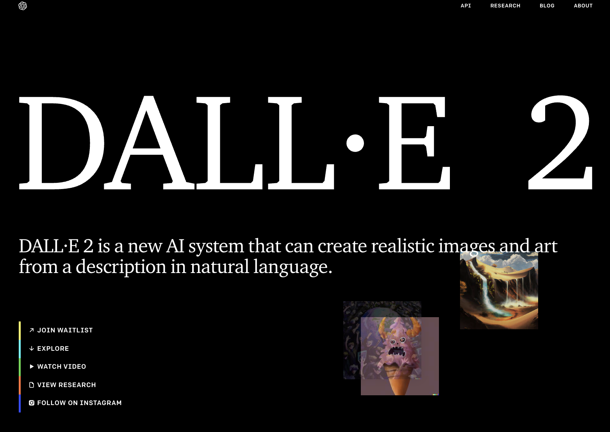
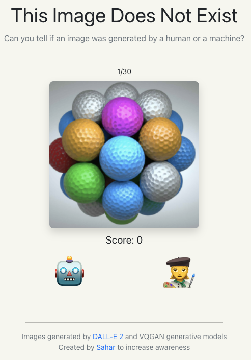
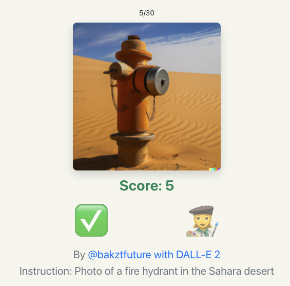
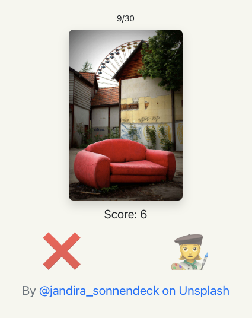

  

Recently, found [an interesting post: thisimagedoesnotexist.com](https://thisimagedoesnotexist.com/) on [Hackernews](https://news.ycombinator.com/) - someone created a website displaying image from a pool and giving viewers two options - "this images is created by AI", "or human beings".
  

This is impressive because the first time when I tried it, I got a score of 5/30. After this failure I found some tricks and tried a second time, and I got a 20/30. 

So the trick is, if the image is simply a combination of few unrelated items and without **telling emotions**, however creative it looks like, it's most likely an AI art. For example, following image is 100% AI art.
  

And this is an image created by human beings. (I guessed it wrong but, if I 'taste' it again, I can feel the 'loneliness' and 'sadness' from the picture)
  

And this 'little trick' also makes sense after reading main page of the AI artist - "[DALL·E 2](https://openai.com/dall-e-2/)" by OpenAI. [This demo](https://openai.com/dall-e-2/#demos) tells that DALL·E 2 is generating those arts from "a text description". "It can combine concepts, attributes, and styles." For example, the "fire hydrant" image above, the instruction is "Photo(*style*) of a fire hydrant(*concept*) in the Sahara desert(*attributes*)".

### More readings:
1. DALL·E 2 Preview - Risks and Limitations: https://github.com/openai/dalle-2-preview/blob/main/system-card.md
2. AI-art isn't art: https://erikhoel.substack.com/p/ai-art-isnt-art?s=r
3. Research - Hierarchical Text-Conditional Image Generation with CLIP Latents: https://arxiv.org/abs/2204.06125