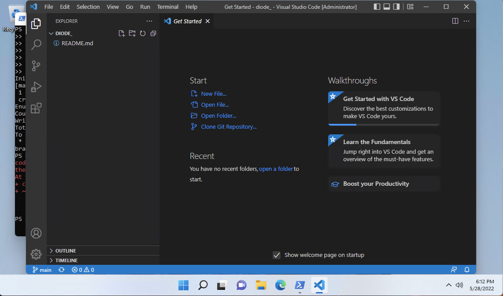
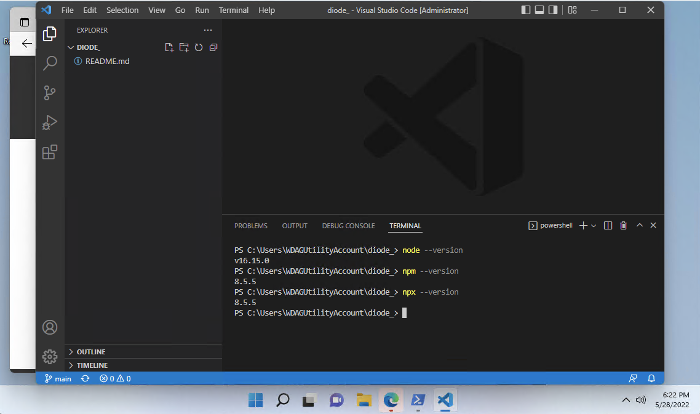
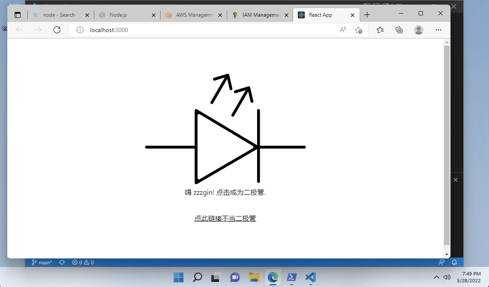

```toc
```

## 1. Minimum Prerequisites
1. Operating System: Windows (TODO: difference in XOS is minimal, will update when available)
2. Amplify is an service hosted on AWS. An AWS account requires a credit card / bank account and phone number to be registered. No charge is expected if you are following this instruction as AWS has [a free-tier policy](https://aws.amazon.com/amplify/pricing/) for the first year. At the end of this instruction, I will also illustrate how to delete the app from your account.
3. A Github account.
4. 30 mins free time.

## 2. Create a new AWS Account Creation
**Skip this section if you already own AWS account.**
1. Log to: https://portal.aws.amazon.com/billing/signup#/start/email, sign up for a new account. Credit card, phone number, address is required.
  

## 3. Host the App on Github
1. Log to: https://github.com/new, create a new repo named "diode". No necessary to change anything else. Note, in my screenshot, as I have already had one repo named "diode", I used "diode_" as its name. Then hit "Create Repository"!
  

2. You will be able to see this page after the repository is created
  

3. **Skip step-3.3 to 6 if you already have Git installed on your system.** We need to install Git for version control. https://git-scm.com/download/win. Select "64-bit Git for Windows Setup" to download Git.
  

4. Click the downloaded and "next" all the way down to install it.
  

5. Now we want to verify the installation. On Windows system, click [Windows logo] then type `powershell` and hit [enter], you should be able to see something like this. We call it terminal.
  

6. Type `git --version` hit [enter]. If you see this, we are good!


7. Run `mkdir diode` to create a new directory then `cd diode` to move into it. Note, still, in my screenshot, I used "diode_" instead of "diode" to avoid duplicates.
  

8. **Skip step-3.8 if you already have your local Git configured for Github.** Don't forget to setup git username and email as we are in the sandbox by running following 2 commands: `git config --global user.name "<your-github-username>"` and `git config --global user.email "<your-github-commit-email-address>"`. Note, the Github commit email address will not be your account email address because Github will keep your email private by default. You can go to your Github mainpage, to find your commit email.
  


9. Now, go back to the browser we used to create the new repository, click the icon in red rectangle to copy all the commands listed.
  

10. Copy paste them into the `powershell` and hit [enter]. It will ask you to input Github credentials to login if you don't have your Github credentials configured.
  

11. Then you should see this, indecating that the Git is setup!
  

## 4. Setup Develop Environment
1. **Skip Step-4.1 if you already have Node.js installed.** Diode is a Javascript application. We will use [node.js](https://nodejs.org/en/) for package management. Go to https://nodejs.org/en/ and click the version - "Recommended for most of users". Download the executable and install it.

2. **Skip Step-4.2 if you already have VSCode installed.** Download and install VSCode from here: https://code.visualstudio.com/Download. You should see the "Welcome page" after the installation. It might be different than mine but it's fine.
  

3. Click "Open Folder" and select the folder named "diode" you created above. If you followed my instruction, it should be inside your user's home (on Windows, it usually is `C:\Users\<your-user-name>\diode`).
  

4. Now, we can execute our command in VSCode by clicking "Terminal" > "new Terminal"
  

5. run following commands to verify that dev env is ready: `node --version`, `npm --version`, `npx --version`. If you see similar output, we are good.
  

6. run `npx create-react-app .` to create an React app. If the command is paused and asks you "OK to proceed?", simply click "y" indecating "yes" and hit [enter] to proceed.
  

7. run `npm i -g @aws-amplify/cli` to install Amplify CLI.

8. run `npm i aws-amplify @aws-amplify/api @aws-amplify/auth @aws-amplify/core @aws-amplify/ui-react` to install all dependency packages.


9. set a checkpoint using Git by running `git add .` then ` git commit -m "All requirements installed"` and `git push`.
  

## 5. Amplify Code Changes, Finally...
1. run `npx amplify init` to initialize an Amplify project. Hit [enter] to use default selections until you see "Press Enter to continue".
  

2. We should see the browser pops up an AWS login page automatically. Use the email address and password we used in Step-2.1 to login. Then go back to VSCode and press [enter].

3. You will be asked to select an AWS region. Ideally, you should check the list here and select one region near you geographically. But here, as we are doing a demo, we will select 'us-east-1' for demo consistancy.
  

4. Hit [enter] until you see "Press Enter to continue" again and browser should pop up again.
  

5. Make sure you select "Access Key" here. 
  

6. Then "next" all the way to the end. And you should see semething like this. Note, **it is very important to keep this page open until you finish step-5.7.** Now go back to VSCode.
  

7. Press [enter] and continue. It wil ask you for "accessKeyId" and "secretAccessKey". Copy paste them from the browser above in step-5.6 and click [enter] all the way down. 


8. If you see this, we are great!
  

9. Then run `npx amplify add api`. Here, we need to be a little bit careful as not all selections are default
    * "Select from one of the below mentioned services" - GraphQL
    * "Here is the GraphQL API that we will create. Select a setting to edit or continue" - **DON'T CONTINUE**, use "up arrow" and select "Authorization modes: API key"
    * "Choose the default authorization type for the API" -  Amazon Cognito User Pool
    * "Do you want to use the default authentication and security configuration?" - Default configuration
    * "How do you want users to be able to sign in?" - Username
    * "Do you want to configure advanced settings?" - No, I am done.
    * "Configure additional auth types?" - N
    * continue
    * "Choose a schema template:" - Single object with fields
    * "Do you want to edit the schema now?" - Y
    * You should see a new text file named "schema.graphql" pops up


10. Copy paste all content [from my example code](https://github.com/ZzzGin/diode/blob/main/amplify/backend/api/toggle/schema.graphql) to "schema.graphql"
  

11. run `npx amplify push`, wait for a while and it will pause for your confirmation and some code generation options, hit [enter] to proceed all with default options. Then go grab a cup of coffee and enjoy 5 mins.
  

12. If you see this, we are great! All backend things are built and we can start developing the frontend
  

13. Delete files in red rectangles. 
  

14. Remove all content in 'index.js' and copy [all content here](https://github.com/ZzzGin/diode/blob/main/src/index.js) into 'index.js'

15. Remove all content in 'App.js' and copy [all content here](https://github.com/ZzzGin/diode/blob/main/src/App.js) into 'App.js'

16. Remove all content in 'App.css' and copy [all content here](https://github.com/ZzzGin/diode/blob/main/src/App.css) into 'App.css'

17. Local testing by running `npm run start`... And... Yes it will take about 1 minute to build our code... Nice! We see our work!
  

18. Create an account and log in. Play with it to verify the function is good.
  

19. We can now go back to VSCode and [ctrl-c] to terminate the local server
  

20. As another checkpoint, we run `git add .`, `git commit -m "all code changes for diode"`, `git push` to push our changes to Github.

## 6. Create a Deployment Pipeline
1. We are now going to link our Github code repository to the Amplify App. We navigate to: https://us-east-1.console.aws.amazon.com/amplify/home?region=us-east-1#/. Note, this is for region "us-east-1", if you selected different region in the step-5.3, you need to choose the right region.
  

2. Our diode app is here! Click on it, and we can see AWS console provides an UI wizard to config Github as code source for continous deployment.
  

3. UI is good but we are developers, we love terminal interface. So, let's go back to VSCode and run `npx amplify hosting add`
    * "Select the plugin module to execute" -  Hosting with Amplify Console
    * "Choose a type" - Continuous deployment
    * This step navigate you to the same page we got in step6.2

4. Select "Github" then "connect branch". Steps will be required to authorize the connection from Amplify to Github.
  

5. Select the code repository name and branch name - we only have one branch - "main", then click "next"
  

6. In the next step, we are asked for some configurations. One question asking "Select an existing service role or create a new one so Amplify Hosting may access your resources" does not have an eligible selection. We need to create a new one. Click the "Create new role".
  

7. Click "next" all the way down to create a new role for Amplify deployment. A role named "amplifyconsole-backend-role" will be created.
  

8. Back to the page in step-6.6, refresh the list and select the newly created role. Then click "next" all the way down.


9. Wait for the pipeline to refresh. It will take around 10 mins.
  

10. Great! Our first deployment is done! We will be able to access our public web app by clicking the URL on this page.
  

11. The above pipeline will be helpful when you make some futher change to the codebase. Once you push your change to Github, this pipeline will be triggered and deploy your new change to public. Try that by yourself!

## 7. Clean up
1. To delete the app you just created, simply navigate to the same page of step-6.2. You should be able to find a button for "Actions". Click it and "Delete App". Follow the instructions and the app will be deleted. With this one click, all resources you created in this hands-on cookbook is deleted. 