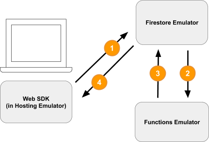

```toc
```

## Official tutorial: [Develop locally with Firebase](https://firebase.google.com/learn/pathways/firebase-emulators#codelab-https://firebase.google.com/codelabs/firebase-emulator)

* The tutorial is based on this github repo: https://github.com/firebase/emulators-codelab
* Install Firebase CLI: `npm install -g firebase-tools`
* Initialize a Firebase project:
  * Log to [Firebase console](https://console.firebase.google.com/u/0/) to create a new project, copy the **project ID**
  * `firebase login`
  * `firebase use $project-id` to link to the cloud resources
* Start the emulator: `firebase emulators:start --import=./seed`
> How to generate testing data - "./seed"?
* If emlator starts failed, might because of the port number is already in used. Change the port number in `firebase.json`
```javascript
// Firebase use below way to fetch resources
const auth = firebaseApp.auth();
const db = firebaseApp.firestore();

// This lines are added to public/js/homepage.js to create a short circuit 
// for local testing. 
if (location.hostname === "localhost") {
    console.log("localhost detected!");
    auth.useEmulator("http://localhost:9099");
    db.useEmulator("localhost", 8080);
}
```
> 2 questions:
> 1. how is the cloud resources setup?
> 2. why auth and db has different ways to useEmulator?

### Firestore Database
* **Firestore Database** is a NoSQL DB but acting like a relational database
  * In the tutorial, there are 2 "collections", or tables: `items` and `carts`
  * item doc schema
    | id | description | imgURL | name | price |
    | --- | ----------- | ------ | ---- | ----- |
  * carts doc schema
    | id | itemCount | ownerUID(same as id) | totalPrice | collection[item-id] |
    | --- | ----------- | ------ | ---- | ----- |
* To access the data, the pattern is `db.collections("carts").doc(uid).collection("items").doc(item-id)`
> How is the db schema defined? Or, is it required to be defined?

### Cloud Function
* **Cloud Functions** can be set to listen to Firestore updating events. In local emulator, it works like:
  
1. client requests to update the Firestore
2. The Cloud Function `calculateCart` listens for any write events (create, update, or delete) that happen to cart items by using the `onWrite` trigger
3. The `calculateCart` function reads all of the items in the cart and adds up the total quantity and price, then it updates the "cart" document with the new totals.
4. The web frontend is subscribed to receive updates about changes to the cart. It gets a **real-time** update after the Cloud Function writes the new totals and updates the UI.
* Cloud Function supports unit test to interact with emulator firestore

### Security Rules
* Firebase uses **Security Rules** to control "who has access to which data"
* What if there are no match statements for an operation?
    * Rules deny by default. If an operation does not match any rules defined in the rules file, access will be denied.
    * **Locked mode**, or Production mode, is making that implicit denial an explicit denial by matching all documents and denying all access.
> What does above 2nd point mean?

* Exmaple rule
```
rules_version = '2';
service cloud.firestore {
    // path matcher
    match /carts/{cartID} {
      allow create: if request.auth.uid == request.resource.data.ownerUID;
      allow read, update, delete: if request.auth.uid == resource.data.ownerUID;
    }

    // ...
  }
}
```
* These rules now only allow read and write access by the cart owner.
* To verify incoming data and user's authentication, we use two objects that are available in the context of every rule:
  * The `request` object contains data and metadata about the operation that is being attempted.
  * If a Firebase project is using Firebase Authentication, the request.auth object describes the user who is making the request.
* What are the key differences between `resource` and `request.resource****`?
  * `resource`: Represents the Firestore document in question **before the current request**. So for a create request, resource.data is always null because the document does not yet exist.
  * `request.resource`: Represents the Firestore document with the changes that the user **wants to write**. So for a create request, request.resource.data contains the proposed document.
* **Rules don't cascade over subcollections**
  * By default, the rules for a document don't cascade to documents in a subcollection.
  * It's common to want slightly different rules for documents in a subcollection.
  * If you want the documents in a subcollection to have the exact same rules, you can use the glob syntax to match all documents recursively: `match /{cartId=**}` (do this with care).
* When can you use a resource or make a `get` call?
  * You can use the resource object when the required data is part of the current document being read/written.
  * If you need data outside the current document, use a get statement. Note that these operations count towards your Firestore bill!
* If we only want to test the permission, we can do it locally. But if we need to do unit test on the Cloud function logic, we have to setup the project ID so our test framework can make a call to GCP to trigger the function. 
> Why the function cannot be run locally?