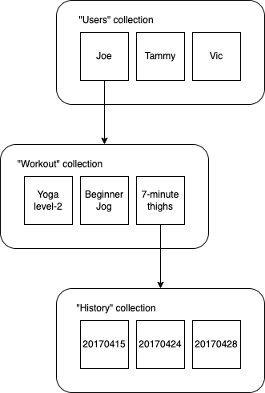
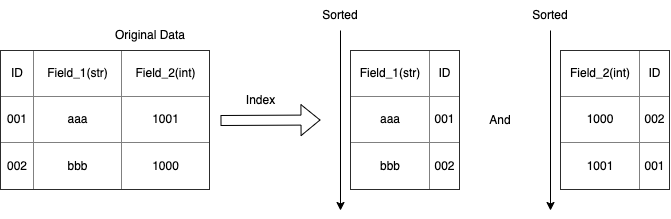
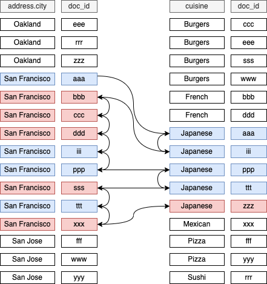
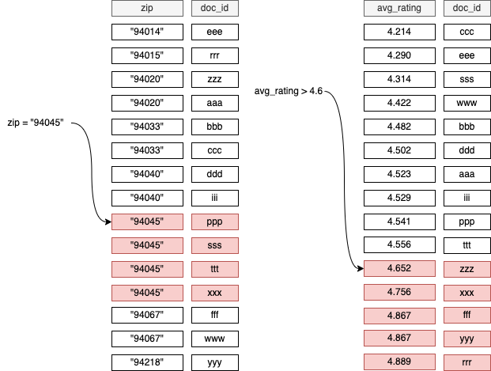
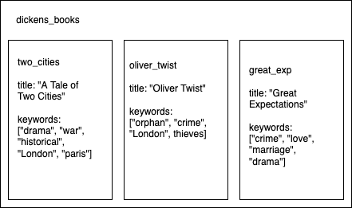

```toc
```

## Document-Dollection Model
1. **Document** is similar to json dictionary, it contains one or multiple **fields** like below:
```
Document
brid_type: "swallow"
airspeed: 42.733
coconut_capacity: 0.62
isNative: false
icon: <binary data>
vector: {
    x: 36.4255
    y: 25.1442,
    z: 18.8816
}
distances_traveled: [42, 39, 12, 42]
```
2. *Collection* is a collection of documents. It can ONLY contain documents.
3. Document can be only < 1MB size.
4. Document cannot contain another do cument. It can contain **sub-collection** but not other document directly.
5. The root of a Firestore tree can only contain collections


## Query Fundamentals
  
1. To navigate in your database, we are will do something like: `firestore.collection(...).document(...).collection(...).document(...)`. Or, we can also access the data by providing a path to that document like this: `firestore.document("/users/user_123/workouts/workout_abc/history/05182017")`
2. In Firebase, query is **shallow** by default. If you grab a parent level document, sub collection will be grabbed.


## Query Rules
1. Firestore will index your fields with a "type". Indexing means the DB will 


2. Idealy, query should only happen in one collections. For example we have a tree like this: [Restaurants] -> [Reviews]:
    * We can query for one restaurant, what are the reviews which have more than 4 stars;
    * Query spam among several collections is called Collection Group Query. For example, if we want to get all reviews higher than 4 stars amoung all restaurants, we need to define:
        * Colleciton ID: "reviews"; Field path: "rating"; Index Scope: "Collection group"
        * This will tell the DB to index the rating fields of every documents in any collection with ID of "reviews"
        * The number of this kinds of CGQ is limited - 200
        * This will index all the collections with the same name. So if there are some unrelated collections of Reviews, they will also be indexed.
3. Firestore does not support "query in one collection then use the queried information to make another query". For example, we cannot query user document in users collections and then join the reviews from that user.
4. Fields can only be queried by using ">", "<", "==". (Because they are sorted.) The idea of Firestore querying is, it will only do query by a. finding one point in the sorted index(using binary search); b. grab adjacent items of that point. For example, "or" and "not" queries are not supported.
5. We can join two fields in one collection, for example, we can do "query all restaurants **city=='SF' and cuisine=='Japanese'**". This is done by doing "zig-zag" querying.
    
    * Above Zig-zag query makes sense when the query is "equal and equal". For "**less and equal**" type of query, it's tricky, because the zig-zag only works when the ID is sorted, but for "less-than" query, ID is not sorted.
      
    * for this kind of query pattern, we can create `composite indexes` for this type of query - `zuocode_rating`:
    ```json
    {
        restaurants:[{
                name: "BurgerThyme!"
                address: {
                    addr_1: "123 Fake Street"
                    city: "San Francisco"
                    state: "CA"
                    zip: "94045"
                }
                cuisine: "Burgers"
                avg_rating: 4.76
                zipcode_rating: "94045_4.76"
            }]
    }
    ```
    * Firestore can do this for us **automatically**. We can manually use Firestore UI to create this composite index or, we can run the query and Firestore will detect this kind of query and generate link for us to create them.
    * With this technic, we can do "equal\equal\equal\...\equal\less_than(more_than)" query.
6. Array in Firestore does not support 'insertAt(idx, el)', 'deleteAt(idx, el)', 'retrieve(idx)'
    *   
    * For above collections, we can make query like: `collection("dickens_books").where("keywords", "array-contains", "drama")`
    * This can be done because behind the scene, Firestore is converting the keywords list to a map: `keywords: ["orphan", "crime", "London", "thieves"]` -> `keywords: {"orphan": true, "crime": true, "London": true, "thieves": true}`

## Data Structuring
1. Do not make document too big (size[1mb max] and fields[20,000 fields]):
    * Document has limits
    * Document cannot be retrieved (and controlled by security rule) partially
2. And, do NOT make document too small (fragmented)
    * data retrieving is shallow
    * you are billed by the number of reads and writes you perform
    * Do not pre-maturely optimize the data structure in order to reduce billing
    * Queries find documents in single collection
3. Put data in the same document if they are always displayed together
4. Put data in collection if **you are going to search for individual piece of the data or if you are expecting it to have rome to grow**
5. As an exmaple of restaurants database, let's say we store "reviews" as a sub-collection under restaurant document. And in our app, we are going to display one restaurant with several (not all) reviews. For this use case, what we can do is create a field inside of restaurant document for "**review_preview**" and store latest (or some other order) reviews. We have Cloud Function to keep this in sync.
6. For "flag" style data, we can either store a map of key->`true` or, we can store them in a list. But, according to the video, the approach of list will not allow you to do 2 attributes query. List is friendly for security rules, like "who is allowed to edit the restaurant".
    ```json
    {
        name: "some restaurant"
        cuisine: "French"
        rating: 4.92
        attributes: {
            takes_reservations: true
            romantic: true
            kid_friendly: false
        }
        editors: [userID_2852, userID_4582]
        // or, better solution for this editor list, so we can do security rule as:
        // allow write if: restaurant.roles[userId] = "editor"
        roles: {
            userId_2852: "editor"
            userId_4571: "editor"
            userId_8123: "owner"
        }
        // however, this approach might leak some information for security reason, a better option is to store this kind of information outside of this collection
        // or, we can have a sub-collection called "private data" and only contain this kinds of secrity data
    }
    ```

## Security Rules
> Below will not cover security coming from server libraries, for example: cloud functions.
1. A security rulle will specify: 
    1. what specific documents you are securing
    2. what logic you are going to secure them.
2. here is an example of security rule, it really just an example, does not make too much sense
    ```
    service cloud.firestore {
        match /databases/{database}/documents {
            match /{document=**} {
                // Completely locked
                allow read, write: if false;
            }
            // ----------------------------------
            match /restaurants/{restaurantID} {
                // (i)
            }
            match /restaurants/{restaurantID}/reviews/{reviewID} {
                // the rules placed here is the same as what it has in (ii)
            }
            // ----------------------------------
            match /restaurants/{restaurantID} {
                match /reviews/{reviewId} {
                    // (ii)
                    allow write: if reviewId == "review_234"
                }
            }
            // ----------------------------------
            match /myCollection/{docId} {
                allow read: if request.auth.token.email.matches('.*google[.]com$');
            }
        }
    }
    ```
3. the `{database}` in this rule is to "wild cards" all the database in firestore. 2 kinds of wildcard:
    1. Single element wildcard - `{database}` or `restaurantID`:
        1. it's just to say: go ahead and match a single path element, either a document or a collection, and stick it into a variable with the name that I specified here.
        2. so at the place - (i), we will have a variable named `restaurantId` and its value is the ID of the restaurant doc
        3. this variable will be available in nested security rule, like place (ii)
    2. "Rest of the document path wild card" - `{document=**}`
        1. it says: go ahead and match the rest of the path and stick it into this variable here
        2. now the `document` will be the rest of the path
4. **WARNING**: the security ruls for the parent document will not be cascade to the nested collection!
5. **WARNING**: security rules will be an *ORDERED* matcher list. First will be applied and if it does not work, the second will be applied... So be careful of some "powerful" rules which can override following rules.
6. For the rule string - `allow read: if reviewId == "review_234"`:
    1. only `allow` keyword is provided. There is no `disallow`. If you want to "block", you can `allow read: if false`
    2. verbs:
        1. `read` includes `get` and `list`
        2. `write` includes `create`, `delete` and `update`
7. `request` is the "input" of the security rule. It contains 2 things:
    1. auth
        1. whether they're an actual signed-in user: `allow read: if request.auth != null`
        2. allow people only when the email from the domain of "google.com" and verified: `allow read: if request.auth.token.email.matches( '.*google[.]com$') && request.auth.token.email_verified;`
    2. resource
        1. security rule can be used to "define the data restriction": `allow create: if request.resource.data.score is number && request.resource.data.score >= 1 && request.resource.data.score <= 5`
        2. with "resource", we can also define some rules to "only let the owner to edit/read the document": `allow update: if request.resource.data.reviewerId = request.auth.uid`
8. `resource` is another object can be used in security rules representing the existing document in database:
    1. for example, user cannot change the score: `allow update: if request.resource.data.score == resource.data.score`
9. **WARNING**: security rule is NOT a filter, it will block a request to a collection and any of the documents failed the security rule.
10. `get()` function can allow you to retrieve data from another document for security rule validation:
    1. `allow update: if get(/databases/$(database)/documents/restaurants/$(restaruantID)/ private_data/private).data.roles[request.auth.uid] in ["editor", "owner"]`
11. Custom Auth Claim: Cloud function can be used to define some fields for security rules. The number is limited.
12. Security Rule support functions:
    ```
    function doesUserHaveGoogleAccount() {
        return request.auth.token.email.matches('.*google[.]com$') && request.auth.token.email_verified
    }

    //...
    allow update: if doesUserHaveGoogleAccount()
    ```

## Pagination
```javascript
myQuery = restaurantRef.whereField("city", isEqualTo: "Tokyo")
    .whereField("category", isEqualTo: "tempura)
    .order(by: "rating", descending: true)
    .limit(to: 20)
```
Above query Will provide the first 20 documents matches this query.

To get the next batch of data:
```javascript
nextBatch = restaurantRef.whereField("city", isEqualTo: "Tokyo")
    .whereField("category", isEqualTo: "tempura)
    .order(by: "rating", descending: true)
    .limit(to: 20)
    .start(after: ["Tokyo", "tempura", 4.9])
// or 
nextBatch = myQuery.start(after: ["Tokyo", "tempura", 4.9])
// however, this will potentially skip documents. 
// So we can do:
mextBatch = myQuery.start(after: previousDoc)
// previousDoc is the LAST document of the previous batch
```

**WARNING**: if the collection is constantly updated, for example some documents are deleted and inserted, those updates might be skipped. To avoid this, in the 2nd query, you should increase the `limit(to: 40)` then `60`.

## Transactions
Batch Write is for Atomic: DB will make sure that one batch write will success for all or failed for all'

Transaction is for Most-up-to-date, 5 steps to perform a transaction: 
1. before writing to DB, it will first read the dcoument; 
2. then, client will have some logic to update the data in the document; 
3. the update will be performed; 
4. then, double check the right change was made; 
5. finally, all changes will be commited.

**When we want to increment or decrement a value, we need to use transaction.**

## Offline Support
> On Andriod and iOS devices, offline support is enabled by default.
### Read
The offline mode for read works in Firestore likes following:
1. [online] You queried Firestore for the top 30 sushi restaurants in SF sorted by price
2. [online] You queried for the top 30 burger restaurants in SF sorted by price
3. [offline] now you can still query for top 30 restaurants in SF sorted by rating. This query will work across the cache data.

### Write
When you make a change to a document, that data will be store on the local device and whether you are online or not, you data will immediately give you the appearence that your change has gone into effect. Any real-time listeners that are watching this data will trigger with your updated data.

By the meantime Firebase will take your change and attempt to send it to the server. After you are online, Firebase library will update your data for reals, and will remove that pending write.

As a summary, offline write will be queued and will be replayed when device goes online. If multiple devices are writing the same document, last write (to the server, even it actually happened before the other) will be applied.

### Notes:
1. Firebase library for web is not enabled for offline support by default
2. The callback function of `collection.add()` will not be triggered when it's in offline mode, because your app is still waiting for the response from the server. When use Firebase, because it has a cache, we don't need to add a callback to handle the fresh data.
3. Transaction will fail in offline mode
4. Offline cache is not indexed so the query will take some time.
5. The default behavior is good enough to ensure a good offline experience.

## Realtime Support
> The main takeaway here is that you should start thinking of realtime as your default behavior, then only switch to one-time fetch call only when you have a good reason to make that change.

## Cloud Function
> When an database action is fired, you can hook a cloud function to this action and execute some custom logic.
### Why?
1. With cloud function, "backend logic" is hosted at the backend (instead of managed by client). So you can easily update it by deploying to backend instead of updating client application;
2. Clients are not trustworthy;

### Notes:
1. Infinite loop: when you have a cloud function executed `onChange()`, and in this function you modify the data, the same function will be triggered again.
2. admin serverside sdk will bypass the security rules.
3. Lazy import is preferred because otherwise all of your cloud function will load those library