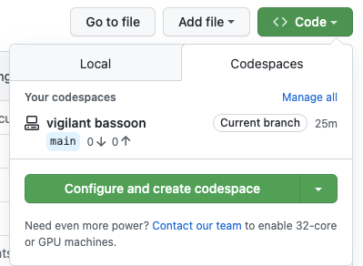
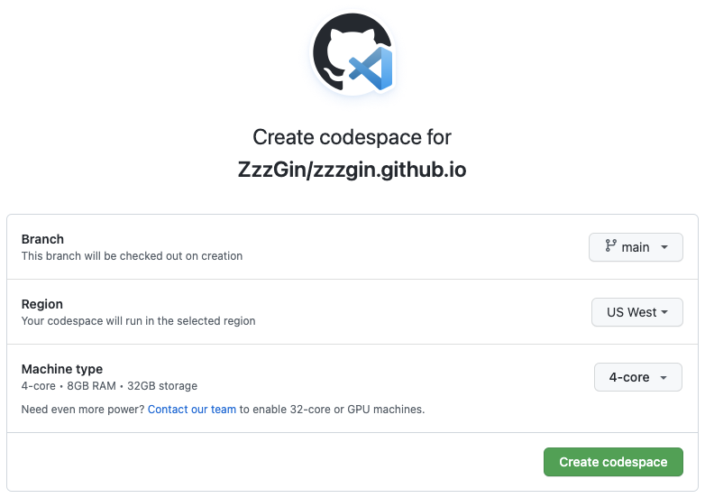
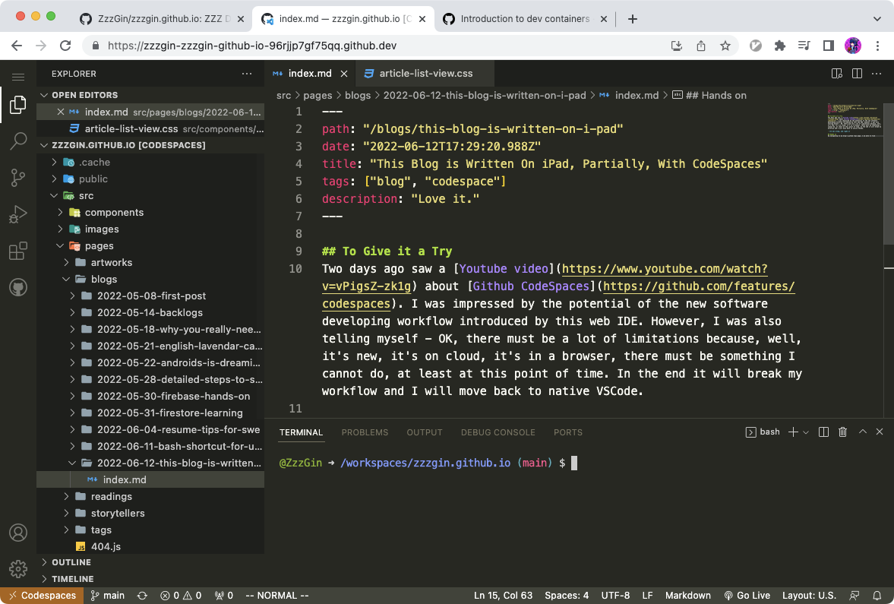
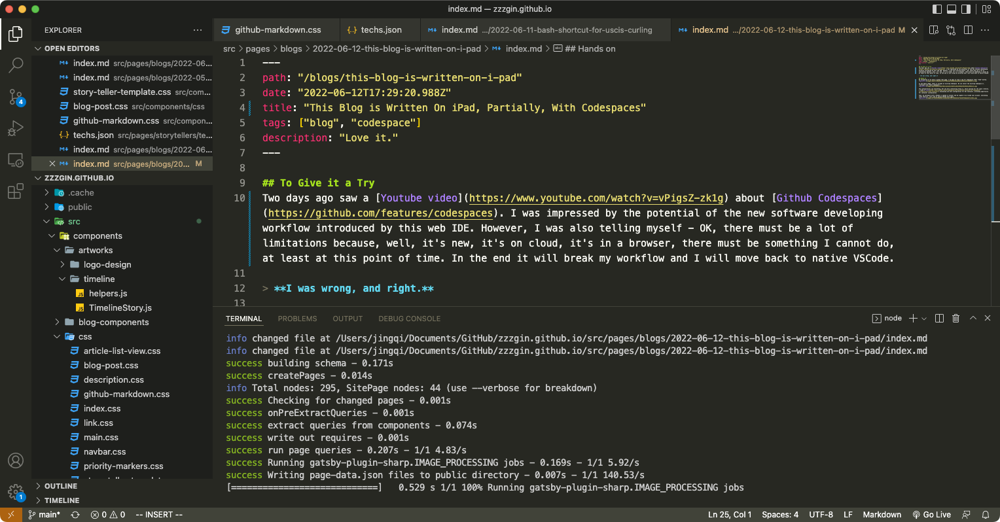
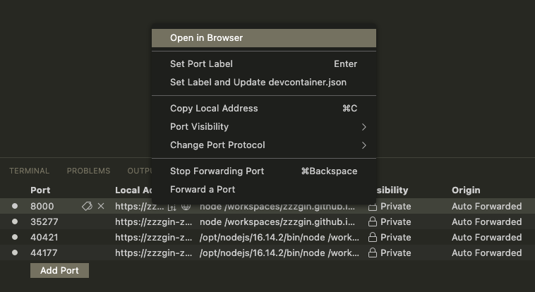
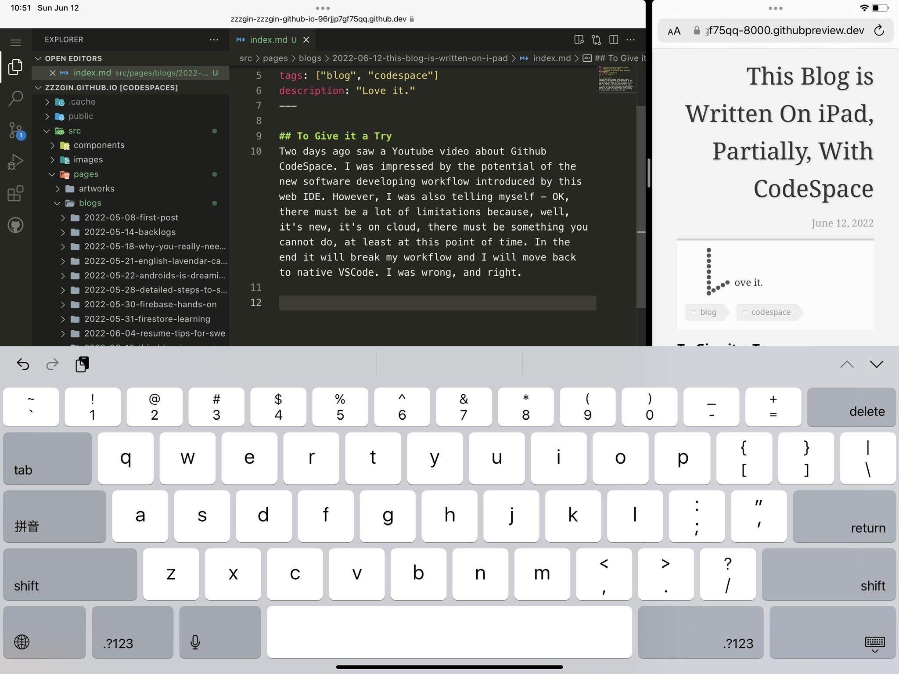
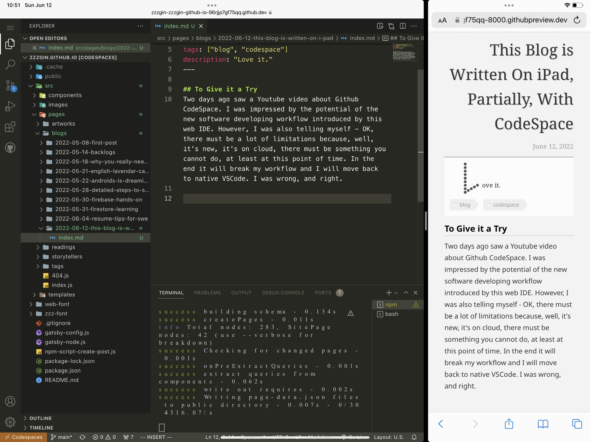

## To Give it a Try
Two days ago saw a [Youtube video](https://www.youtube.com/watch?v=vPigsZ-zk1g) about [Github Codespaces](https://github.com/features/codespaces). I was impressed by the potential of the new software developing workflow introduced by this web IDE. However, I was also telling myself - OK, there must be a lot of limitations because, well, it's new, it's on cloud, it's in a browser, there must be something I cannot do, at least at this point of time. In the end it will break my workflow and I will move back to native VSCode. 

> **I was wrong, and right.**

## Hands on
By navigating to my blog's github repo page, I am able to find a tab for Codespaces under "Code" buttom.
  

In the above image, there is already an existing Codespace. We can select the existing Codespace or, "Configure and create codespace":
  

The configurations say everything. But one more interesting thing is, while waiting for the space creation, I found [a wiki](https://docs.github.com/en/codespaces/setting-up-your-project-for-codespaces/introduction-to-dev-containers) displaying one more configuration for Dev Container, providing opportunity for container customization. 

Then, my workspace with a VSCode is opened in browser and by signed in my vscode sync account, everything looks familiar, just like my native VSCode work space.
  
  

Crazy right? My cosmetic plugins - [Material Icon Theme](https://marketplace.visualstudio.com/items?itemName=PKief.material-icon-theme) and [VIM](https://marketplace.visualstudio.com/items?itemName=vscodevim.vim) plugin also work (look) like a charm.

Even more, developing preview is also impressive. My blog is a Gatsby website. Simply running `npm run start`, Codespaces hosts a "local" preview server in the container and does a port forwarding to public network. You can configure the behavior of port forwarding:
  

Everything is the same as my current workflow for writing blog in my native VS code! TBH, I am impressed. One of my worries when I decided to host my website using Gatsby is, I have to sit down at my desk and write. Now, looks like I can write blog using my iPad or, my phone!

And this is what I get on iPad, like a dream, right?
  

However, there is a "however".

## Dev Workflow, My Version
Before talking about "however", noting down my understanding of the workflow of using Codespace:
* A Codespace is equivalent to a host or a virtual machine. It provides you a container with VS Code as an interface. You can install `apt` pacakges to the container. 
* After the creation of Codespace, your selected git branch will be fetched. The logic of using Git is the same as what it is like on the local machine.
* Same Codespace is synchronized in real time. If you have multiple browser opened and edit in one of them, other browsers will see the same change in real time. If a seperate working branch is needed, you need to create a new Codespace container.
* To preview the change, as long as the framework you used provide a way to preview in localhost, Codespace will do port forwarding automatically and enable you to preview your change in a "public" url.

## However...
### <low-marker /> Font Issue
* Font of terminal on iPad is problematic
      

### <medium-marker /> VIM Customization Shortcuts are not Synced
* I have `ss` as short cut for [VIM easy motion](https://github.com/VSCodeVim/Vim#:~:text=%22vim.easymotion%22%3A%20true%2C). I cannot use the same sortcut by default after migrating to Codespace.

### <critical-marker /> Markdown Image plugin does not work
* [The plugin](https://marketplace.visualstudio.com/items?itemName=hancel.markdown-image) cannot upload the image and insert the url to Markdown file