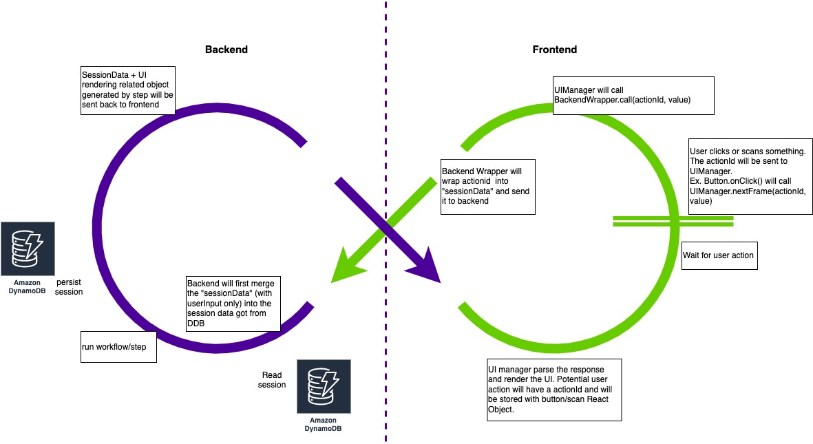

```toc
```

## Application 1 - A Web UI Application

### Overview
A UI application with Java Spring-based backend and JSP (migrating to React) frontend hosted on Tomcat server. Stateless application, using session Id tracked in cookies to retrieve/store session date from DynamoDB.

The application provides users a UI illustrating directed workflows to achieve business purposes. The frontend-backend interaction follows "single API pattern":


The frontend is simply a "one-page application". It receives a json telling it to "put this text in the textbox with this id in the UI". This json also enable/disable potential user input components in the UI by providing ID, for example scanner/button. Once user triggered any action, the action ID and it's value will be sent to the backend API.

The backend receives the request and will fetch session data from DB by the session id in the request. Session data is a list of "serializable object" storing the current states. Overall, the backend is a state machine, given the states from session DB, plus user action ID and value, it will compute the next "step" of states based on the defined state transition logic. Selected "next step" will be sent back to the frontend and will be used for rendering.

### TPS/QPS
There are 3 main regions of this application.
* Region 1: there are 24.5M of "Unit-of-Work" every day and 6.2% of them are processed by this app, about 1.5M/Day. TPS is 61(MAX, 1 min dp), 25(MIN, 1min dp) and 45(AVG, 1min dp)
* Region 2: there are 10M of "Unit-of-Work" every day and 10% of them are processed by this app, about 1M/Day. TPS is 32(MAX, 1 min dp), 3(MIN, 1min dp) and 17(AVG, 1min dp)
* Region 3: there are 2.2M of "Unit-of-Work" every day and 3% of them are processed by this app, about 67K/Day. TPS is 4(MAX, 1 min dp), ~0(MIN, 1min dp) and 1.3(AVG, 1min dp)

### Latency (region 1, 1min dp)
> "AVG Stat" means the datapoints are calculated as the avg of datapoints in 1 min
* AVG Stat: 742ms; MAX: 1042ms; MIN: 583ms
* p90 Stat: AVG: 1585ms
* p99 Stat: AVG: 2786ms

### Critical Dependencies (region 1)
#### DynamoDB for Session Data
* WCU(/s): Min: 14.175; Max: 75.46; Average: 51.204
* RCU(/s): Min: 46.309; Max: 243.06; Average: 165.63
* Latency: 
    * Get: 1.6ms
    * Put: 3.5ms
* Item count (with 12 hours TTL): 41K
* Table size: 155 megabytes
* Avg item size: 3780 bytes
* Point-in-time recovery: Enabled
* GSI/LSI: None

### Billing (region 1)
* EC2 usage: Unknown
    * `21` m5-xlarge hosts
    * CPU usage is around 10%
* Session Data DynamoDB: $620/month, with provisioned RCU as 274 and WCU as 895
* CloudWatch: $45,797.97/month (reason: unknown)
* Lambda (used for one usecase in this app): 
    * Every 1 min, will be triggered once, 1460 invocations/day
    * Duration is 20s in AVG
    * $25/month
* Another DynamoDB:
    * Item Count: 105,720,519
    * Table Size: 16.1 Gigabytes
    * Average item size: 152.02 bytes
    * WCU/s: ~50
    * RCU/s: ~0
    * Billing: $162/month

## Application 2 - AWS-Heavy Application

### Overview
Application 2 heavily depends on AWS services. Its clients push messages into SNS-SQS input buffer, then application 2 fetches messages from SQS and do aggregation on the message then push to different destination in AWS.

### TPS/QPS and Latency (region 1)
* API-1: 
    * TPS: AVG: 463; MAX: 750; MIN: 100;
    * Latency: AVG: 180ms; p99: 355ms
* API-2: TPS: AVG: 2; Latency: AVG: ~200ms;
* API-3: TPS: AVG: 2; Latency: AVG: ~100ms;
* API-4: TPS: AVG: 3; Latency: AVG: ~200ms;
* API-5: TPS: AVG: 266; latency: AVG: 75ms;
* API-6: TPS: AVG: 5; latency: AVG: ~500ms;

### Critical Dependencies and Billing (region 1)
* CloudWatch: 87 Dashboards: $267/month
* Cognito: 183 users: $2.75/month
* Data Tranfer
    * Data transfer in per month: 5689.145GB: $0
    * regional data transfer - in/out/between EC2 AZs or using elastic IPs or ELB: 3272.145GB: $32.72
    * first 10TB/month data transfer out: 1024GB: $921
    * next 40TB/month data transfer out: 19544.948GB: $1661.32
* DynamoDB: 18.455GB data, 458 RCU/s, 2ZWCU/s
    * 521,570.000 ReadCapacityUnit-Hrs: $67.8
    * 26,040.000 WriteCapacityUnit-Hrs: $16.93
    * 25GB free GB-Months free tier: $0
    * PITR Storage: $3.52
* Kinesis Firehose: 14,388.931 GB data ingested
    * $417.28
* OpenSearch Service: 
    * Data nodes: 36 nodes, m5.2xlarge.search, 1400GiB
    * Master nodes: 3 nodes, m5.large.search
    * Snapshot: hourly
    * Billing: $22,250/month
* Redshift:
    * $0.250 per Redshift Dense Compute Large (DC2.L) Compute Node-hour (or partial hour)7,430.908 Hrs
    * $1857.72/month
* SNS: $1365/month
    * Note: on average, one request will generate 2 SNS publishing
* SQS: $2427.15
    * Note: one request one message
* S3: 
    * Amazon Simple Storage Service Requests-Tier1: 0.005 per 1,000 PUT, COPY, POST, or LIST requests1,052,492.000 Requests - $5.26
    * Amazon Simple Storage Service Requests-Tier2: 0.004 per 10,000 GET and all other requests956,677.000 Requests - $0.38
    * Storage: 85,875.333 GB-Mo - $1940.46/month
* In total: $59011.99/month

## Application 3 - DynamoDB Intensive Application
### Overview
This application heavily depends on DynamoDB.

### TPS/QPS and Latency (region 1)
* API-1(GET): TPS: AVG: 511; Latency: AVG: 10.19ms; p99: 38ms
* API-2(GET): TPS: AVG: ~1; Latency: AVG: 20ms; p99: 75ms
* API-3(PUT): TPS: AVG: 348; Latency: AVG: 56ms; p99: 172ms

### Billing (region 1)
* Table 1:
    * Item count: 22,413,875,643
    * Table size: 14.5 TB
    * Average item size: 647.13B
    * RCU/s: 17248 (previsioned: 38,670)
    * WCU/s: 2067 (prevision: 4550)
    * Put latency: -
    * Query Latency: 6ms
* Table 2:
    * Item count: 556,608,790
    * Table size: 141.2 gigabytes
    * Average item size: 253.72 bytes
    * RCU/s: 944 (previsioned: 2225)
    * WCU/s: 3.3 (prevision: 20)
    * Put latency: -
    * Get latency: ~1ms
* Table 3:
    * Item count: 849,617,771
    * Table size: 565.1 gigabytes
    * Average item size: 665.09 bytes
    * RCU/s: 2074 (previsioned: 4693)
    * WCU/s: 216 (prevision: 490)
    * Put latency: -
    * Get latency: 2ms
* Total billing:
    * $22,722.04
* Additional:
    * CloudWatch: $3,849