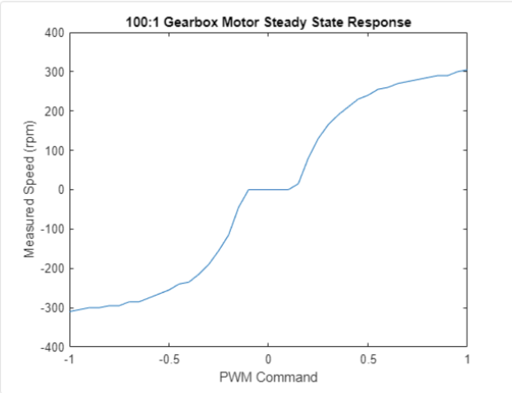
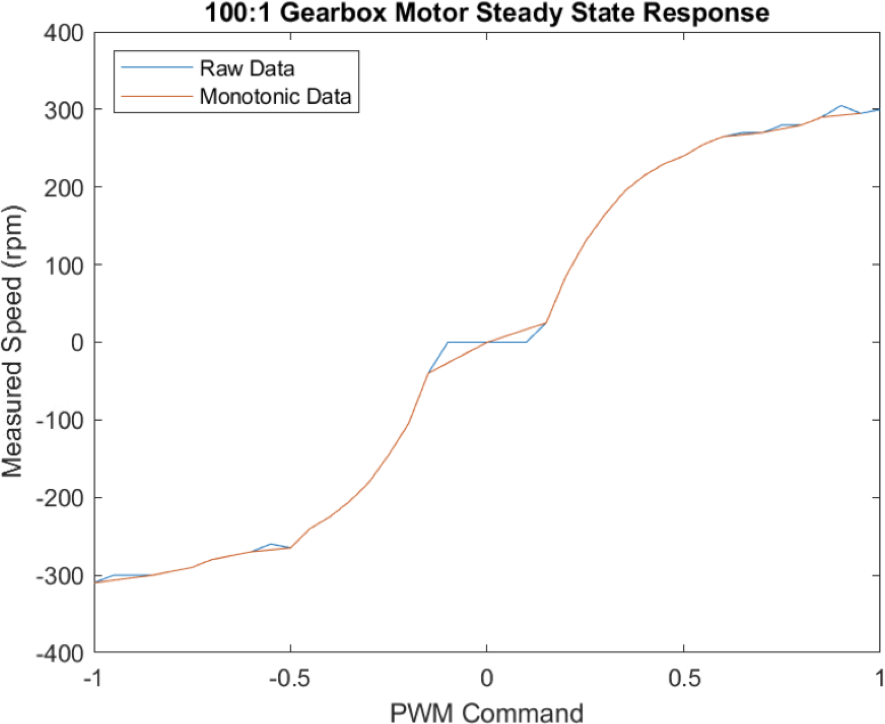

```toc
```

## Measure the relation between PWM Duty Cycle and Speed
```matlab
%% 1. Create test data 

maxPWM = 1.00;                          % Maximum duty cycle
incrPWM = 0.05;                         % PWM increment
PWMcmdRaw = (-maxPWM:incrPWM:maxPWM);   % Column vector of duty cycles from -1 to 1
speedRaw = zeros(size(PWMcmdRaw));      % Initialize a vector for speed raw reads
```

```matlab
%% 2. Create and initialize device objects 

clear a dcm carrier enc              % Delete existing device objects

a = arduino;
carrier = motorCarrier(a);
dcm = dcmotor(carrier,'M1');         % Connect a DC motor at 'M1' port on the Arduino Nano Motor Carrier board

enc = rotaryEncoder(carrier,1);      % Connect the encoder of 'M1' at the encoder port 1 on the Arduino Nano Motor Carrier boardColumn vector of duty cycles from -1 to 1
```

```matlab
%% 3. Measure raw motor speed for each PWM command

dcm.Speed = 0;                             
gearRatio = 100;                            % As per the motor spec sheet, gear ratio equals 100:1
start(dcm)                                  % turn on motor
dcm.Speed = PWMcmdRaw(1);                   % this assigns the first value to dcm.Speed
pause(1)                                    % wait for steady state
speedRaw(1) = readSpeed(enc)/gearRatio;     % read motor speed in rpm of the output shaft
stop(dcm);                                  % turn off motor
dcm.Speed = 0;   
```
After running this section, the DC motor will run at max speed (-1) for 1 second and stop. Array - speedRaw will record the encoder counter read.

To measure all possible values, we use for-loop:
```matlab
%% 3. Measure raw motor speed for each PWM command

dcm.Speed = 0;                              
gearRatio = 100;                                % As per the motor spec sheet, gear ratio equals 100:1
start(dcm)                                      % turn on motor

for ii = 1:length(PWMcmdRaw)
    dcm.Speed = PWMcmdRaw(ii);
    pause(1)                                    % wait for steady state
    speedRaw(ii) = readSpeed(enc)/gearRatio;    % read motor speed in rpm of the output shaft
end

stop(dcm)                                       % turn off motor
dcm.Speed = 0;
```

Now visualize the result:
```matlab
%% 4. Graph raw data

plot(PWMcmdRaw,speedRaw)      % raw speed measurements
title('100:1 Gearbox Motor Steady State Response')
xlabel('PWM Command')
ylabel('Measured Speed (rpm)')
```



## Post-Process Speed Measurements to remove "Dead Zone"
To create a **motor control system**, in which a user will request a motor speed in rpm and system gives the PWM duty value, we need to remove repeated values.

```matlab
%% 5. Post-process and save data
idx = (diff(speedRaw) > 0)                        % speedRaw is 1x41 vector. diff calculates the 
                                                % difference between 2 consecutive values. idx 
                                                % is a 1x40 vector containing 1 and 0. 1 means at
                                                % that index, the diff is not 0.

speedMono = speedRaw(idx);                      % speedMono is a sub-set of speedRaw with different 
                                                % values

PWMcmdMono = PWMcmdRaw(idx);
PWMcmdMono(speedMono == 0) = 0;                 % enforce zero power for zero speed
save motorResponse PWMcmdMono speedMono         % save post-processed measurements
```

```matlab
%% 6. Graph raw and post-processed data

plot(PWMcmdRaw,speedRaw)                            % raw speed measurements
hold on
plot(PWMcmdMono,speedMono)                          % non-monotonic measurements filtered out
title('100:1 Gearbox Motor Steady State Response')
xlabel('PWM Command')
ylabel('Measured Speed (rpm)')
legend('Raw Data','Monotonic Data','Location','northwest')
```


```matlab
%% 6. Delete device objects

clear a dcm carrier enc
```

## Creating Matlab Functions
By creating "live function", we can manage reusable functions by defining:
```matlab
function [PWMcmdMono,speedMono] = myMotorFunction(PWMcmdRaw,dcm,enc)
```

With the help of this function, section 3-6 can be replaced by one line of function call.

> In the tutorial, to save data to work place, it uses `save(filename, 'vector-1', 'vector-2')`. However, it looks like it does not work in my workplace. I need to change it to `save filename vector-1 vector-2`.

With the file myMotorCharacterization.mlx and myMotorFunction.mlx, we can run `clear` then `myMotorCharacterization` in the command window to reuse the characterization funcion. `PWMcmdMono` and `speedMono` will be saved in motorResponse.mat file.