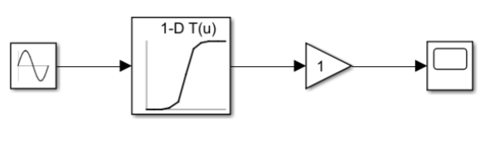
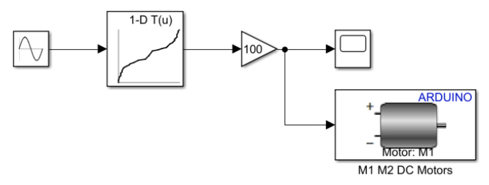
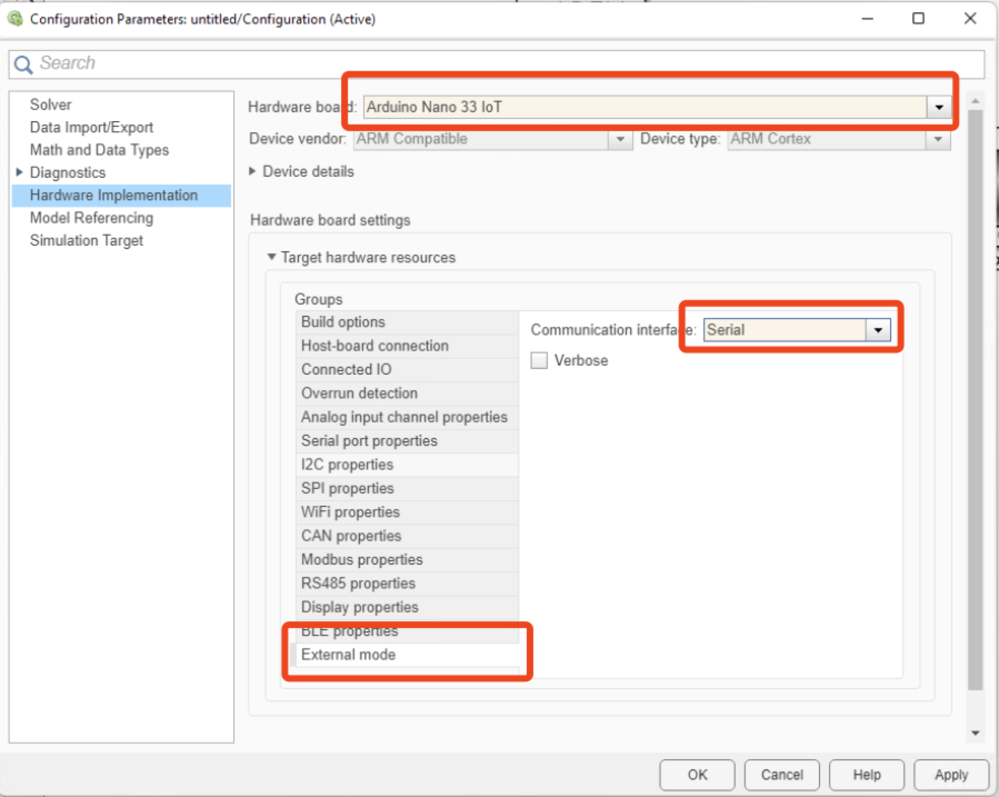

```toc
```

## Create the Blocks

* "Sine Wave" to simulate the speed input.
* "1-D Lookup Table" to convert the user's speed signal comming from the Sine Wave block into a PWM signal between -1 and 1.
* "Gain" block to multiplies a Simulink signal by a constant value.
* "Scope" block to visulize the output.

## Configure the Blocks
* `load motorResponse` to load the previous saved speedMono and PWMcmdMono
* We can see that the RPM is around 300. Then we configure the "Sine Wave" block as `amplitude-300, frequency-0.2`
* To configure the "1-D Lookup Table", we set Table data to PWMcmdMono and set Breakpoints to speedMono.
* "Gain" block: Amplify the PWM duty cycle to cover a range of -100 to 100, to be compatible with the motor driver later. Double-click the Gain block and set Gain to 100. Then click OK:
* To access the motor connected to the Arduino Nano Motor Carrier you need an **Arduino Device Driver block**.


## Deploy the Model to Arduino
* MODELING > Model Settings: 

* Then, HARDWARE > Monitor & Tune: to build an executable and upload to hardware.

> Note: change the baud rate to 9600.