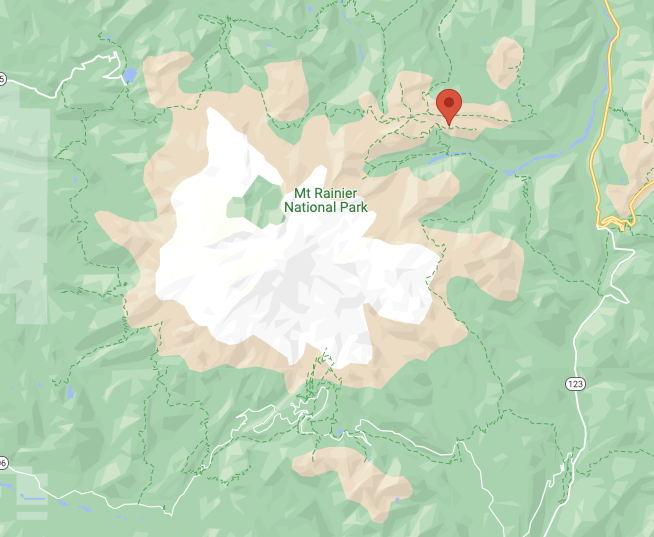

```toc
```

## Trail's Links
[National Park Service](https://www.nps.gov/mora/planyourvisit/mount-fremont-lookout.htm)

[All Trails](https://www.alltrails.com/trail/us/washington/mount-fremont-lookout-trail-via-sourdough-ridge-trail)

[Google Maps](https://www.google.com/maps/place/Mount+Fremont+Lookout+Trail/@46.9136431,-121.6462857,16.52z/data=!4m5!3m4!1s0x5490c92acce93a15:0x66d74e7db90ad8dc!8m2!3d46.9148391!4d-121.642285)

## Info:
* Distance, round trip: 5.6 miles
* Elevation gain: 900 feet
* Hiking time, round trip: 3 hours
* Wilderness Camps: None


## Road Status
[nps.gov](https://www.nps.gov/maps/stories/road-status.html)

## Webcams
[npm.gov](https://www.nps.gov/mora/learn/photosmultimedia/webcams.htm)