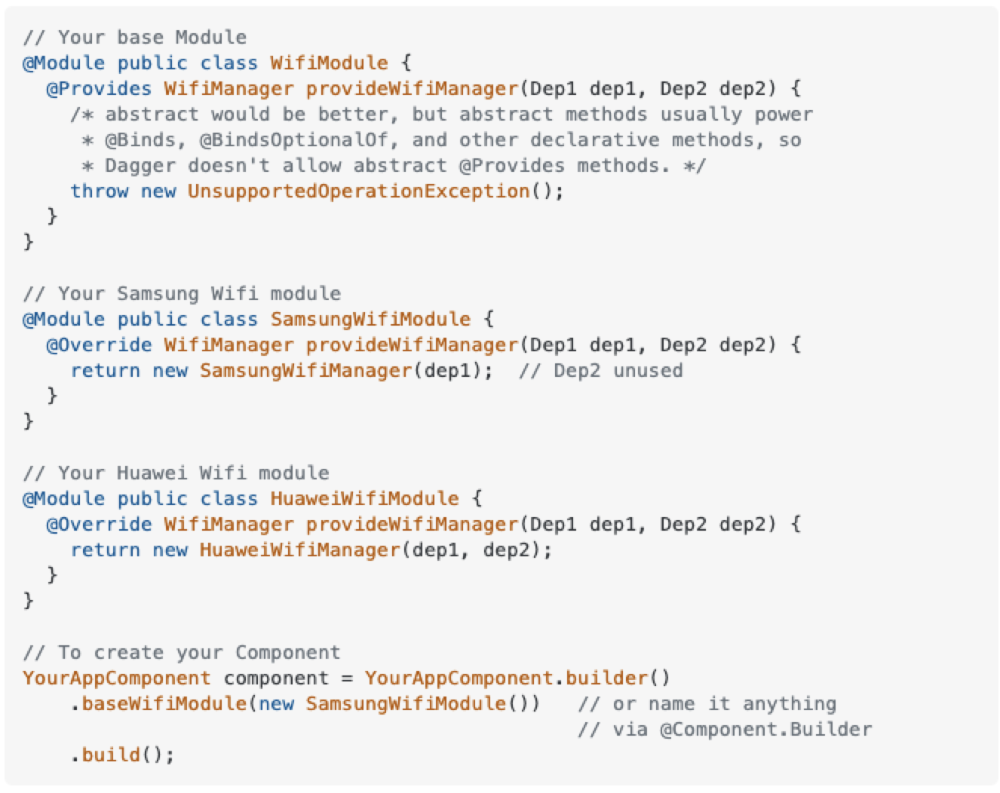

```toc
```

## Dynamically provide implementations at run time
[A very nice blog by David Medenjak](https://blog.davidmedenjak.com/android/2017/04/28/dagger-providing-different-implementations.html).

In the above blog, the author explained a solution to dynamically privide different implementations at runtime. Here is the scenario for example:
> We want to create a car factory. The car has an engine. It could be electronic engine or gas engine. We want to use a boolean of the factory to control which engine to be used.

```java
@Module
interface GasEngineModule {
  @Binds Engine engine(GasEngine engine);
}

@Module
interface ElectricEngineModule {
  @Binds Engine engine(ElectricEngine engine);
}

interface EngineComponent {
  Engine engine();
}

@Component(modules = GasEngineModule.class)
interface GasEngineComponent extends EngineComponent { }

@Component(modules = ElectricEngineModule.class)
interface ElectricEngineComponent extends EngineComponent { }

@Component(dependencies = EngineComponent.class)
interface CarComponent {
  Car getCar();
}

// factory methods to make a car
EngineComponent engineComponent = DaggerGasEngineComponent.create();
DaggerCarComponent.builder()
    .engineComponent(engineComponent)
    .build();
```

Or, without using component dependencies, `CarComponent.Builder` with `@BindsInstance` can do the same thing:
```java
@Component
interface CarComponent {
    interface Builder {
        @BindsInstance
        Builder engineComponent(EngineComponent engineComponent);
        CarComponent build();
    }
    Car getCar();
}
```

## Optional Injection
How to use `@BindsOptionalOf`? Check [this SO post](https://stackoverflow.com/questions/39175576/optional-injection-dagger-2).

## Inject module subclasses at runtime
Check [this SO post](https://stackoverflow.com/questions/48874448/dagger2-how-to-conditionally-choose-modules-at-runtime).

