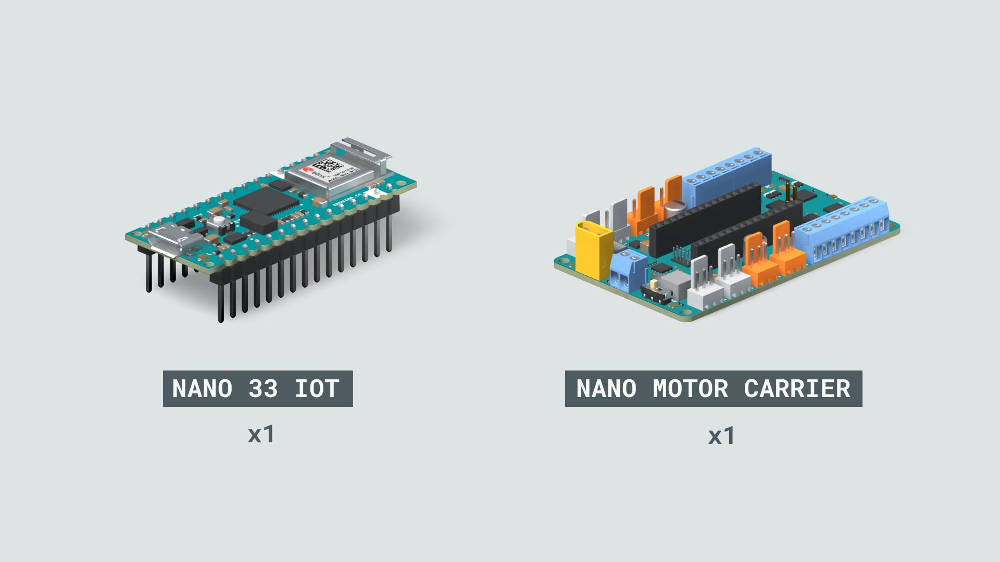
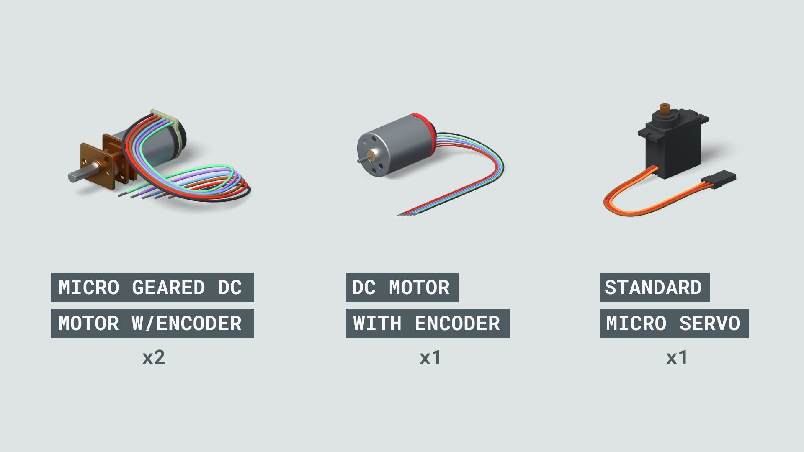

```toc
```

## In the kit


* **Arduino NANO 33 IOT**: is an Arduino board:
    * Atmel ATSAMW25 SoC.
    * Wifi connectivity
    * Small
    * IoT effective
    * [$20.30](https://store-usa.arduino.cc/products/arduino-nano-33-iot)
* **Arduino Nano Motor Carrier**: is an expansion board for Nano family
    * control servos, DC moters, and stepper moters
    * [$71.30](https://store-usa.arduino.cc/products/arduino-nano-motor-carrier?selectedStore=us)



* **Micro Geared DC Motor W/Encoders**
    * 12V DC Motor with Encoder
    * 100:1 gearbox to increase the torque
    * (About) [$12.50](https://www.digikey.com/en/products/detail/adafruit-industries-llc/4641/13162130?utm_adgroup=Motors%20-%20AC%2C%20DC&utm_source=google&utm_medium=cpc&utm_campaign=Shopping_Product_Motors%2C%20Solenoids%2C%20Driver%20Boards%2FModules_NEW&utm_term=&utm_content=Motors%20-%20AC%2C%20DC&gclid=Cj0KCQjwkruVBhCHARIsACVIiOyhAtk8nAssUEol4sOMIbSm6yCzDEYaO9_miPfZajrxb3CkgIxHxlAaAtS_EALw_wcB)
* **DC Motor with Encoders**
    * 12V DC motor with encoder
    * no gearbox
    * (About) ~$10
* **Standard Micro Servo**
    * Is a type of motor what can be controllerd from an Arduino board without a need of any other components.
    * Standard servos have a rotation angle limited to 180 degrees with a precise control over the angle of rotation.

---
* **USB Web Cam**
* **Mechanical Parts**

## Softwares
* Matlab
* Plugin - MATLAB Support Package for Arduino Hardware
* Plugin - Simulink Support Package for Arduino Hardware
* Plugin - MATLAB Support Package for USB Webcams 
* Project Files - Arduino Engineering Kit Project Files