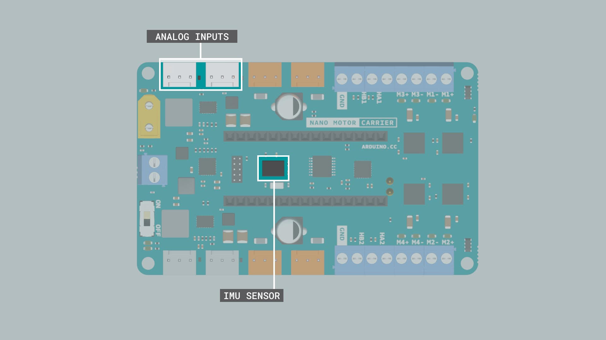

```toc
```

## The Arduino Environment

> [Arduino Hardwares](https://www.arduino.cc/en/hardware)


* Arduino Nano 33 IoT
    * ARM Cortex M0+
    * Wifi module with a crypto-chip to ensure secure communication
    * Can be configured to constrain its power consumption to keep it running for long periods

### Board Hardware

* ARM Cortex M0+
    * 32 bit chip
    * low-cost
    * lowest power requirements of all the Cortex-M processors
    * Allow developers to optimize power usage for specific applications
* IME Sensor
    * 3D digital acelerometer
    * 3D digital gyroscope
    * 1.25mA
* Wi-Fi Module: Nina W102 Wifi module
    * Multi radio
    * Integrated antenna
    * Wifi and bluetooth
    * IoT
* Digital and Analog Pins
    * 
    * 19 Digital Pins marked as D2-D21
        * Digital pins can transmit values of 0 OR 3.3V, relative to GND
        * Or can receive data, the voltage is interpreted as HIGH or LOW, relative to some threshold between 0 and 3.3V
    * 8 Analog pins, A0-A7.
        * Analog pins can transmit or receive voltage values between 0 and 3.3V, relative to GND
    * D14-D21 or A0-A7 can both transmit and receive voltage values and there are also called General purpose Input/Output(GPIO) pins.
    * **Never apply more than 3.3V to pins of Arduino Nano 33 IOT**
* GND, 5V, 3V, VIN
    * GND, 5V and 3V are reference valtage lines
    * VIN pin can be used to provide poser to the board from an external battery source
* RX/TX
    * Used for communication between the Arduino board and a computer or other devices
    * All Arduino boards have at least one serial port (also known as a UART or USART), and some have several. It communicates on digital pins 0 (RX) and 1 (TX) as well as with the computer via USB. Thus, if you use these functions, you cannot also use pins 0 and 1 for digital input or output.
* I2C
    * Inter-Integrated-Circuit is a bus-based serial communication **protocal** that happens using two signal pins: SDA(data signal) and SCL (clock signal)
    * This protocol allows you to connect several devices to the same lines (SDA and SCL) and each device is selected by calling its unique address identifier.

### IDE

* Special functions in Sketch Editor
    * `setup()`: called once, when the sketch starts
    * `loop()`: called over and over and is heart of most sketches
* Verify means compiling

### Arduino Nano Motor Carrier

> The Arduino Nano Motor Carrier is compatible with all the boards from the Arduino Nano Family

| Feature | Description |
| ------- | ----------- |
|Microcontroller | ATSAMD11 ( Arm Cortex-M0+ @48 Mhz)|
|Max Input voltage (power terminals) | 4V (1S Li-Ion Battery)|
|Max output current per motor driver | 1 Amp|
|Motor driver output voltage | 12V|
|Over Temperature shutdown protection (for DC motor drivers) | Yes|
|Battery type | Li-ion battery (1S)|
|Battery charging | Yes|
|Max battery charging current | 500mA (configurable)|
|Power terminals (connectors) | XT-30 and 2POS terminal block|
|Interface | Terminal block and 3 pin/4 pin header connector|
|Servo connector | 4 terminals|
|Stepper connector | 2 terminal|
|Encoder inputs | 2 ports|
|DC motor control | 4 ports|
|3V digital/analog sensor input/output | 4 ports|
|IMU | BNO055 9axis Accelerometer / Gyroscope/ Magnetometer|


* The SAMD11 Microcontroller
    * The SAMD11 is used to control the servos, read values from the encoders, and read the battery voltage in an autonomous way. 
    * This microcontroller receives commands and send information to the Arduino Nano 33 IoT via I2C.
* Servo Outputs
    * The Servo pins handle all the communications between the servos and the Arduino Nano 33 IoT. 
    * Accessing the connected servos can be easily done with their corresponding Servo objects Servo1, Servo2, Servo3 and Servo4 from the IDE.
* DC Motor Outputs
    * The DC motor terminal pins are used to connect any DC motor to the Carrier board. 
    * There are 4 terminals, M1, M2, M3 & M4, marked with a +ve and -ve sign. You can connect 4 DC motors at the same time but there are only 2 encoder inputs. 
    * The polarity signs signifies the direction of rotation of the connected motors.
* DC Motor Drivers
    * The Motor Carrier features 4 motor drivers for high-performance DC motor control with direct connection to the Arduino Nano 33 IoT. Each driver allows you to control one DC Motor. 
    * The DC motors are connected to the Arduino Nano Motor Carrier using the blue connectors (terminal blocks) on each side of the board. 
    * The motors have to be connected in the pins that are labeled (M1+ M1-, M2+ M2-, M3+ M3- and M4+ M4-).
* Encoder Inputs
    * These terminal blocks adjacent to the DC motor terminals can be used to read the encoder values from the attached DC motors through the terminals HA1-HB1 & HA2-HB2.


* Lipo Battery Connector
    * When working with motors, you will need an external source to feed the motor drivers and power up the motors. You can do this by connecting a LiPo Battery to the battery connector.
* Boost Convertor
    * A boost converter is a DC-to-DC power converter that steps up voltage from its input to its output.
* External Power Connector
    * Other external power sources can be connected to the VIN input on the terminal block.


* Analog Inputs
    * The carrier board also comes with 4 analog connectors used for connecting 3 pin analog sensors to the carrier board. These connectors are connected to the analog pins A2, 3, 7 and 6.
* IMU Sensor
    * This carrier features the BN0055, a 9-axis (acc+gyro+magnetometer) orientation sensor. 
    * This IMU (Inertial measurement unit) module can measure how the carrier board behaves under changes in linear acceleration, angular rotation, and, in some cases, the magnetic field around the module.


* Motor LED : This led indicates which motors are on and which directions they are spinning.
* Signal Fault LED : This lights up when there's a fault condition in the driver due to over current or over temperature.
* On LED : This LED signals when the board is powered.
* UI LED : User interface LED usually lights up when there is a problem with the library version that is incompatible with firmware version.
* BAT LED : The Battery LED Lights up when the battery is being charged.


* Plug in Nan 33 IoT to Motor Carrier.
    * Some of pins will stop being available because they will be needed to control some of the features of the Carrier
        * Digital pin D2 for IN2 signal for Motor3
        * Digital pin D3 for IN1 signal for Motor3
        * Digital pin D4 for IN2 signal for Motor4
        * Digital pin D5 for IN1 signal for Motor4
        * Digital pin D6 for Interrupt signal from the SAMD11 to the Arduino Nano 33 IoT
        * Digital pin A4/SDA for the SDA signal (I2C)
        * Digital pin A5/SCL for the SCL signal (I2C)
    * to control the motors, need to import the Arduino nano Motor Carrier Library: [here](https://www.arduino.cc/reference/en/libraries/arduinomotorcarrier/)
    * [How to install library](https://docs.arduino.cc/software/ide-v1/tutorials/installing-libraries)
* Charging the Battery
    * Prerequisites:
        * The Arduino Nano 33 IoT Board is connected to the Arduino Nano Motor Carrier,
        * The Arduino Nano 33 IoT Board is connected to the power source via the USB,
        * The power switch on the Arduino Nano Motor Carrier is On.
    