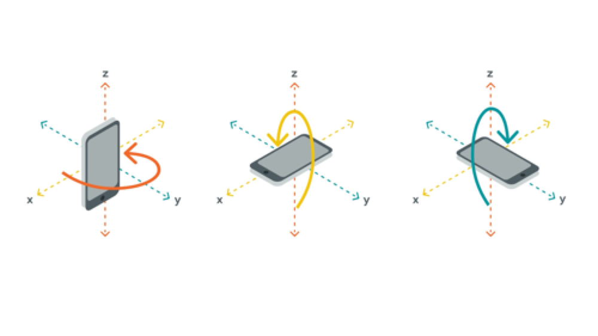

```toc
```

## Standard Servo
* Allow for precise control of position (angle) or angular velocity from a midrocontroller.
* There are 2 kinds of servo motors:
    * standard servo: there is a limit on the angle of tern
    * continuous rotation servo: can continuously rotate like a DC motor
* 3 terminals:
    * GND
    * 5V
    * Control signal
* To control servo motors, we use PWM(pulse width modulation) signals
    * 1ms/20ms -> 0°
    * 1.5ms/20ms -> 90°
    * 2ms/20ms -> 180°

## Inertial Measurement Unit (IMU)
* The Inertial Measurement Units are devices used to measure a body’s orientation and acceleration using a combination of accelerometers, gyroscope and magnetometers.
* Accelorometer: it uses (x, y, z) to measure the acceloration at the 3 directions
* Gyroscope: uses (x, y, z) to provide rotation data. 
    * 
* Magnetometer: mearures magnetic fields. Generally used to detect the earth magnetic field as a way to orient our device like a digital compass.
* IMU on the carrier: BN0055, 9-axis (acc+gyro+magnetometer) orientation sensor

## Battery & Holder
* 3 ratings on LiPo battery to define batteries:
    * voltage
        * each LiPo cell has a nominal voltage of 3.7V. Multiple cells can be added in series and multiply the voltage.
        * As a matter of note, the nominal voltage is the default (or ideal), resting voltage of a battery pack. This is how the battery industry standardizes and compares batteries. However, this does not represent the full charge voltage of the cell. LiPo batteries are fully charged when they reach 4.2V/cell, and their minimum safe charge is 3.0V/cell. 3.7V is a median value, and that is the nominal charge of the cell. A representation of both the ideal (blue) and experimental values (orange) for voltage as a function of discharge capacity is shown in the figure below.
        * Many battery controllers have protection for over- and under-charging conditions.
    * capacity
        * mAh: milliamp hours, represents how much current can be extracted from the battery to discharge it in one hour
        * Extreme temperatures and high current draw can reduce the effective capacity.
    * discharge rate
        * $MaximumCurrentDraw = BatteryCapacity * DischargeRating$
        * For example if the discharge rating is 5C and the capacity of the battery 2500mAh then we can obtain the maximum peak current of the battery as follows: 12,500mA = 2500mAh * 5C
        * The discharge rating is a function of the operating conditions and falls over the lifetime of the battery.
* Battery in the kit
    * 2500mAh
    * 3.6V
    * 20A
    * weight: 43.8g