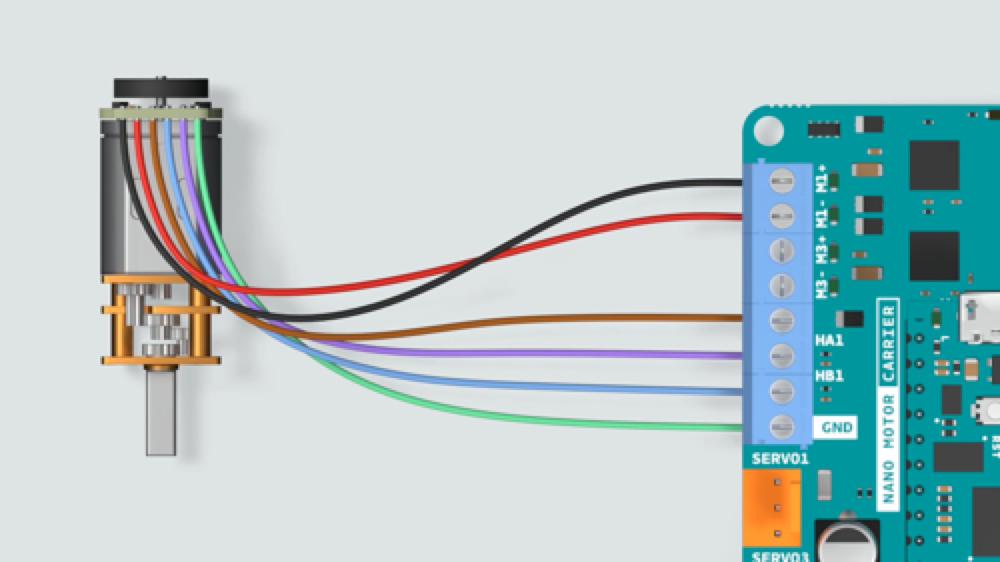

```toc
```

## Run DC Motor
1. Connect the Arduino board to the carrier with the correct direction
2. Connect the dc motor with gear to carrier:

| DC Motor with gear | carrier |
| ----- | ------- |
| M+ (black) | M1+ | 
| M- (red) | M1- | 
| VCC (brown) | [empty] | 
| OUTB (blue) | HA1 | 
| OUTA (purple) | HB1 | 
| GND (green) | GND | 

3. Ensure the toggle on the carrier is at "off" side
4. Plug in the usb port -> We should see green light on Arduino board and orange light on carrier
5. Turn on the toggle
6. `a = arduino()` to initialize the Arduino board
7. `carrier = motorCarrier(a)` to initialize the carrier
8. `dcm = dcmotor(carrier, "M1")` to assign the dc motor at M1 port to dcm
9. `dcm.start()` to start the controller, the motor will not be triggered because the speed is 0
10. `dcm.Speed = 1` to assign a value (between -1 and 1) to speed
11. `dcm.stop()` to stop the controller
12. `enc = rotaryEncoder(carrier,1)` to initialize the encoder of the motor at port 1
13. `readCount(enc)` to read the encoder count buffer
    1. run `readCount(enc)` and get the value
    2. manually trun the magnatic disk full rotation
    3. run `readCount(enc)` and get the value again.
    4. the diff of 2 values will be 12. Which means every "1" value is 30 degree of rotation.
14. `resetCount(enc)` to reset

