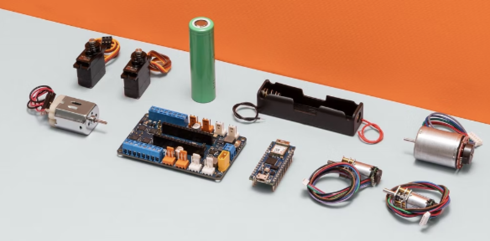
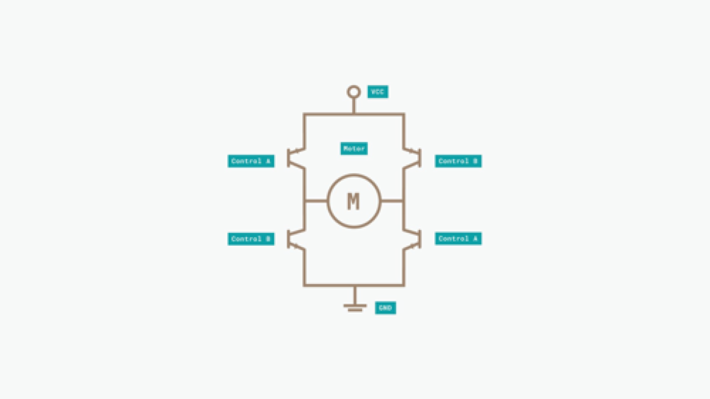
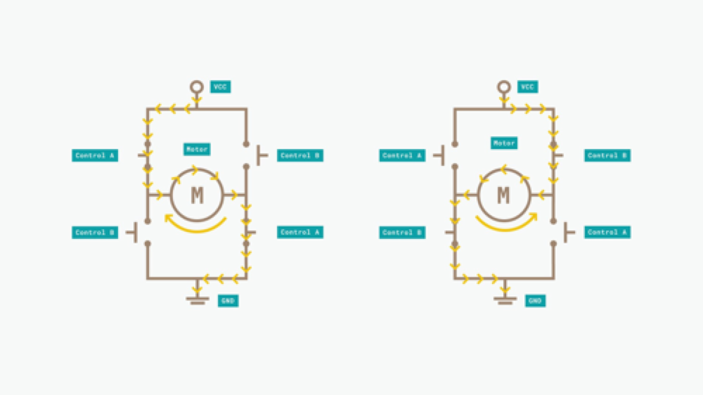
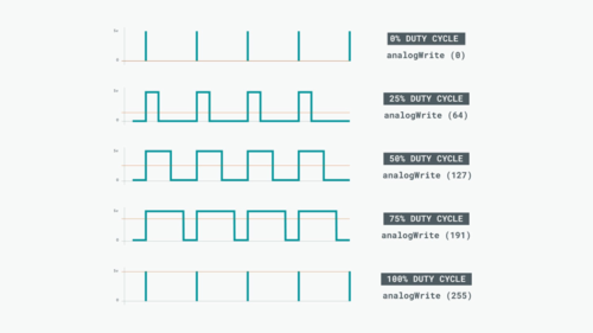
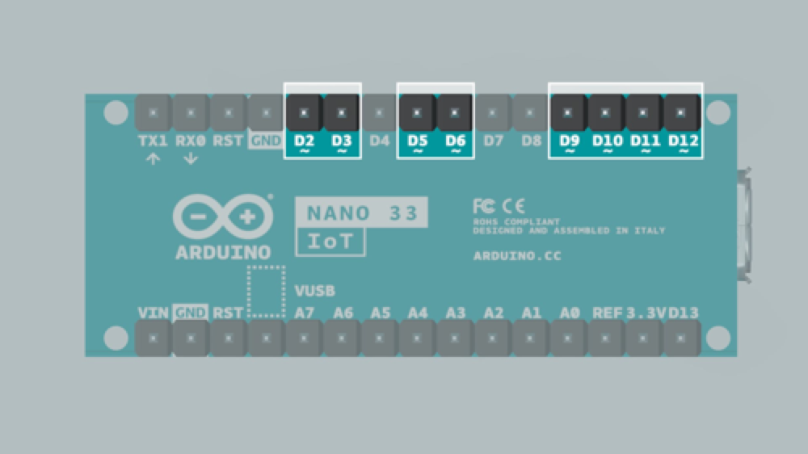
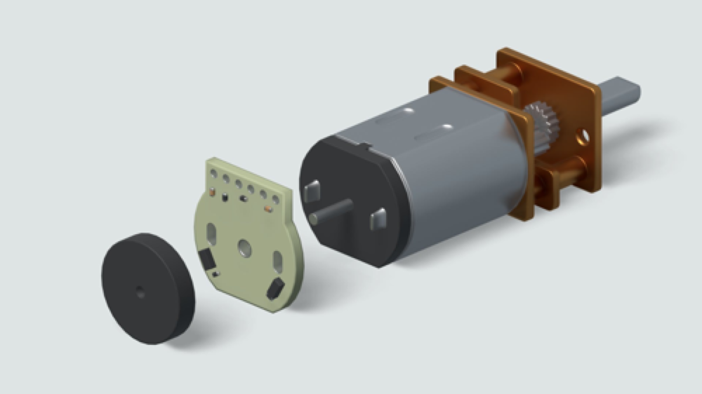
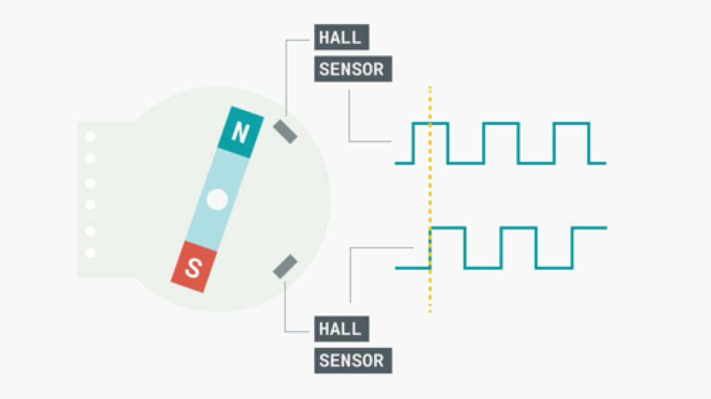
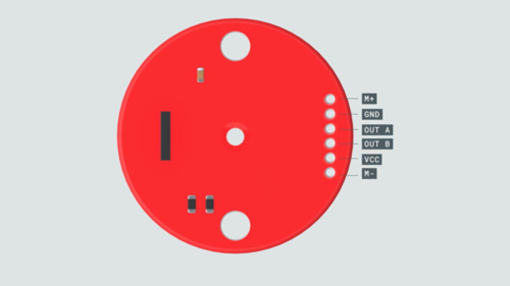
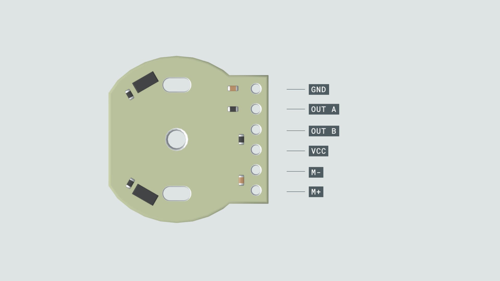

```toc
```

## DC Motors

### How does it work
* The DC motor spins when we apply DC voltage through its two terminal pins. 
* We can vary the speed of the motor by changing the voltage level.
* motors can run freely in both directions just by reversing the direction of the current.
* **Not** very good for precise movement, but they can provide very high rotational speeds.

### Characterstics of Motors
1. **Speed**: 
    1. Max speed at no load
2. **Stall Torque**: 
    1. This is commonly presented in kg-cm and sometimes in Newton-meters, and it gives you a frame of reference for the maximum strength of the motor (i.e., when the motor can no longer rotate because of overload).
3. **Stall current**:
    1. The amount of electric current in Amperes that is consumed by the motor under a maximum load (stall).
4. **Operating voltage**:
    1. The range of voltages that the motor is designed to work within.

### Driving DC Motors with Arduino
Arduino board is not recommended to connect the output pins of the microcontroller directly to the motor terminals as the motor's current demand can damage the chip.

 To control a DC motor from a microcontroller without damaging the microcontroller, you’ll need to use a circuit in between called **driver**. This can be a transistor, a relay or an H-Bridge. The Arduino Nano Motor Carrier uses **H-Bridges** to drive the DC motors.


**H-Bridge**

An H-Bridge is an electronic circuit that allows us to change the current direction applied to a load. They are commonly used as motor drivers to **change the direction** and **the speed** of a DC motor and to manage the higher power since microcontrollers usually don’t have enough current to power an electric motor. For example, In this kit we will use the H bridges in the Arduino Nano Motor Carrier to provide 12V to our motors while safely controlling them with 3.3V signals from the microcontroller.



The H-Bridge contains four transistors arranged so that the current can be driven to control the direction of the spin and the angular speed. These transistors behave as four switches that are controlled in pairs. The current flows in a different direction depending on which switches are activated. This allows the direction of the motor itself to be controlled.



|Signal Control A | Signal Control B | Movement |
| --------------- | ---------------- | -------- |
| HIGH | LOW | Clockwise |
| LOW | HIGH | Counter-Clockwise|
| LOW | LOW | Slow Stop|
| HIGH | HIGH | Fast Stop|

### H-Bridges in the kit
* we have 4 H-Bridges chips located in the top side of the Motor Carrier
* the chips are controlled through I2C via the SAMD11 microcontroller present in the Motor Carrier
* This driver has a current sense resistor that limits the amount of current the chip can drive
* In the Motor carrier, the current is limited to 1.5A

### Controlling Speed
> PWM, Pulse Width Modulation. This is possible because since the motor cannot change speed so fast, it acts as a **low pass filter** and it behaves as if it is receiving the average (analog) value of the voltage and current being applied.



### PWM in Microcontrollers
In the Arduino boards, PWM pins are denoted with a “tilde” ~ symbol next to the pin number. On an Arduino Nano 33 IoT, the pins are 2, 3, 5, 6, 9, 10, 11 and 12.



Arduino API: `analogWrite(255)` -> 100% duty. `analogWrite(127)` -> 50% duty.


### Reading Motor Speed
> Hall effect sensor is capable of detecting the Hall effect. This consists of the production of a voltage difference across an electrical conductor when a magnetic field is applied.

As the motor turns, the disc rotates past the sensors. Each time a magnetic pole passes a sensor, the encoder outputs a digital pulse, also called a “tick”. By counting the frequency of those ticks, the speed of the motor can be determined.



The encoder has 2 outputs, one for each Hall effect sensor. The sensors are positioned so that there is a phase of 90 degrees between them. This means that the square wave outputs of the two Hall effect sensors on one encoder are 90 degrees out of phase. This is called a quadrature output.



If output A is ahead of output B, the motor is turning forward. If output A is behind output B, the motor is turning backward.

By measuring the frequency of the pulse signal in A or B (in this case it’s not important from which one), we will obtain the speed at which the motor is turning.

### Specs of DC Motors in Kit
* Micro motor with gear with Encoder
    * Speed (No load): 320 RPM
    * Stall Torque: 2.2 Kg-cm
    * Gear ratio: 100:1
    * Ticks per revolution (without gearbox): 12
    * Ticks per revolution (when accounting for gearbox): 1200
* DC Motor with Encoder
    * Speed (No load): 7500 RPM
    * Stall torque: 150g-cm
* PINs
    * 
    * 
    * GND and VCC are for ground and voltage input
    * OUT A and OUT B are for speed/direction read output
    * M+ and M- are for the H bridge
* Arduino Nano Motor Carrier contains a data buffer for each of the two encoder ports. Each time the A or B signal changes from the encoder chip, the value in the data buffer is incremented or decremented by one. The resulting integer value is the encoder count, which we can read any time we need it.