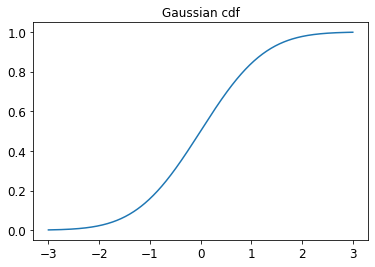
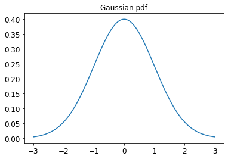
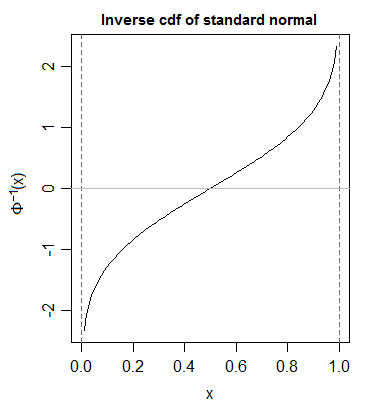

```toc
```

### 2.1.3.2 Probability of an event
We denote the joint Probability of events A and B both happening as follows:
$$
Pr(A \wedge B)=Pr(A, B)
$$

If A and B are independent events, we have:
$$
Pr(A, B)=Pr(A)Pr(B)
$$

### 2.1.3.3 Probability of a union of two events
The probability of evetnt A or B happening is given by:
$$
Pr(A \vee B)=Pr(A)+Pr(B)-Pr(A \wedge B)
$$

If the events are mutually exclusive (so they cannot happen at the same time), we get:
$$
Pr(A \vee B)=Pr(A)+Pr(B)
$$

### 2.1.3.4 Conditional probability of one event given another
We define the conditional probability of event B happening given that A has occurred as follows:
$$
Pr(B|A) \triangleq \dfrac{Pr(A, B)}{Pr(A)}
$$

### 2.1.3.5 Independence of events
We say that event A is independent of event B if:
$$
Pr(A, B)=Pr(A)Pr(B)
$$

### 2.1.3.6 Conditional independence of events
We say taht events A and B are conditionally independent given event C if:
$$
Pr(A, B|C)=Pr(A|C)Pr(B|C)
$$

This is written as $A \bot B|C$. 
Events are often dependent on each other, but may be rendered independent if we condition on the relevant intermediate variables.

### 2.2 Random variables
If the value of $X$ is unknown and/or cound change, we call it a random variable or rv. The set of possible values, denoted $\mathcal{X}$, known as the sample space or state space.

### 2.2.1 Discrete random variables (pmf)
If the sample space $\mathcal{X}$ is finite or countably infinite, then $X$ is called a discrete random variable. 
In this case, we denote the probability of the event that $X$ has value $x$ by $Pr(X=x)$.
We define the **probability mass function** or **pmf** as a function which computes the probability of events which correspond to setting the rv to each possible value:
$$
p(x) \triangleq Pr(X=x)
$$
$0 \leq p(x) \leq 1$ and $\sum_{x \in \mathcal{X}} p(x)=1$

### 2.2.2 Continuous random variables
If $X \in \mathbb{R}$ is a real-valued quantity, it is called a **continuous random variable**.

### 2.2.2.1 Cumulative distribution function (cdf)
Define the events $A=(X \leq a)$, $B=(X \leq b)$ and $C=(a < X \leq b)$, where $a<b$. We have that $B=A \vee C$, and since $A$ and $C$ are mutually exclusive, the sum rules gives:
$$
Pr(B)=Pr(A)+Pr(C)
$$
and hence the probability of being in interval $C$ is given by
$$
Pr(C)=Pr(B)-Pr(A)
$$

In general, we define the **cumulative distribution function** or **cdf** of the $rv$ $X$ as follows:
$$
P(X) \triangleq Pr(X \leq x)
$$
Using this, we can compute the probability of being in any interval as follows:
$$
Pr(a<X \leq b)=P(b)-P(a)
$$
Here is an example of cdf for standard normal distribution: $\mathcal N (x|0,1)$
  


### 2.2.2.2 probability density function (pdf)
We define the **probability density function** or **pdf** as the derivative of the cdf:
$$
p(x) \triangleq \dfrac{d}{dx}P(x)
$$
Example of pdf for standard normal distribution: $\mathcal N (x|0,1)$
  


Given a pdf, we can compute the probability of a continuous variable being in a finite interval as follows:
$$
Pr(a<X \leq b)= \int_{a}^{b}p(x)=P(b)-P(a)
$$
As the size of the interval gets smaller, we can write
$$
Pr(x \leq X \leq x+dx) \approx p(x)dx
$$

### 2.2.2.3 Quantiles (percent point function, ppf)
If the cdf $P$ is **strictly monotonically increasing**, it has an inverse, called the **inverse cdf**, or **percent point function (ppf)**, or **quantile function**.
For example, let $\Phi$ be the cdf of Gaussian distribution $\mathcal N (x|0,1)$, and $\Phi^{-1}$ be the inverse cdf.

  


If the distribution is $\mathcal N (\mu, \sigma^2)$, then 95% interval becomes ($\mu-1.96\sigma, \mu+1.96\sigma$). This is often approximated by writing $\mu \pm 2\sigma$

### 2.2.3 Sets of related random variables
We have two random variables, $X$ and $Y$. We can define the **joint distribution** of two random variables using $p(x, y)=p(X=x, Y=y)$ for all possible values of $X$ and $Y$.
With finite cardinality, we can represent the joint distribution as a 2d table:
| $p(X,Y)$ | $Y=0$ | $Y=1$ |
| -------- | ----- | ----- |
| $X=0$    | 0.2   |  0.3  |
| $X=1$    | 0.3   |  0.2  |

Given a joint distribution, we define the marginal distribution of an rv as follows:
$$
p(X=x)=\sum_y p(X=x,Y=y)
$$
This is also called the sum rule.

We difine the **conditional distribution** of an rv using
$$
p(Y=y|X=x) = \dfrac{p(X=x,Y=y)}{p(X=x)}
$$

We can rearrange this equation to get
$$
p(x,y) = p(x)p(y|x)
$$
This is called the product rule.

By extending the product rule to $D$ variables, we get the **chain rule of probability**:
$$
p(x_{1:D})=p(x_1)p(x_2|x_1)p(x_3|x_1,x_2)p(x_4|x_1,x_2,x_3)...p(x_D|x_{1:D-1})
$$

### 2.2.4 Independence and conditional independence
We say $X$ and $Y$ are **unconditional independent** or **marginally independent**, denoted $X \bot Y$, if we can represent the joint as the product of the two marginals, i.e.,
$$
X \bot Y \Longleftrightarrow p(X,Y) = p(X)p(Y)
$$

In general, we say a set of variables $X_1, ... , X_n$ is independent if the joint can be written as a product of marginals, i.e.,
$$
p(X_1,...,X_n)= \prod^n_{i=1}p(X_i)
$$

Unconditional independence is rare. We therefore say $X$ and $Y$ are **conditionally independent (CI)** given $Z$ iff the conditional joint can be written as a product of conditional marginals:
$$
X \bot Y | Z \Longleftrightarrow p(X,Y|Z)=p(X|Z)p(Y|Z)
$$

### 2.2.5 Mean of a distribution
For continuous rv's, the mean is defined as follows:
$$
\mathbb{E} [X] \triangleq \int_\mathcal{X} xp(x)dx
$$

For discrete rv's, mean:
$$
\mathbb{E}[X] \triangleq \sum_{x \in \mathcal{X}}xp(x)
$$

Mean is a linear operator, we have
$$
\mathbb{E} [aX+b] = a\mathbb{E}[X]+b
$$
This is called linearty of expectation.

For a set of $n$ rv's, one can show that the expectation of their sum is as follows:
$$
\mathbb{E}[\sum_{i=1}^{n}X_i]=\sum_{i=1}^{n} \mathbb{E}[X_i]
$$

If **they are independent**, the expectation of their product is given by
$$
\mathbb{E}[\prod_{i=1}^{n}X_i]=\prod_{i=1}^{n} \mathbb{E}[X_i]
$$

### 2.2.5.2 Variance of a distribution
The **variance** is a measure of the "spread" of a distribution, often denoted by $\sigma^2$.
$$
\begin{split}   
\mathbb{V}[X] &\triangleq \mathbb{E}[(X-\mu)^2]= \int (x-\mu)^2p(x)dx \\
&=\int x^2p(x)dx + \mu^2\int p(x)dx - 2\mu \int xp(x)dx \\
&=\mathbb{E}[x^2]+\mu^2-2\mu^2\\
&=\mathbb{E}[X^2]-\mu^2 = \sigma^2
\end{split}
$$
from which we derive the useful result: 
$$
\mathbb{E}[x^2]=\mu^2 + \sigma^2
$$

The standard deviation is defined as:
$$
std[X] \triangleq \sqrt{\mathbb{V}[X]}=\sigma
$$
This is useful since it has the same units as $X$ itself.

Shifted and scaled variance:
$$
\mathbb{V}[aX+b]=a^2 \mathbb[X]
$$

Variance of the sum of a set of $n$ independent random variables:
$$\mathbb[\sum^n_{i=1}X_i]=\sum^n_{i=1}\mathbb{V}[X_i]$$

Variance of the product of a set of $n$ independent random variables:
$$\mathbb{V}[\prod^n_{i=1}X_i]=\prod_i(\sigma^2_i+\mu^2_i)-\prod_i\mu^2_i$$

### 2.2.5.3 Mode of a distribution
The **mode** of a distribution is the value with the highest probability mass or probability density:
$$
x^*=\argmax_xp(x)
$$

### 2.2.5.4 Conditional moments
When we have two or more dependent random variables, we can compute the moments of one given knowledge of the other. For example, the **law of iterated expectations**, also called the **law of total expetation**, tells us that:
$$
\mathbb{E}[X]=\mathbb{E}[\mathbb{E}[X|Y]]
$$

Similarly, for variance, we have the **law of total variance**, also called the **conditional variance formula**, tells us that:
$$
\mathbb{V}=\mathbb{E}[\mathbb{V}[X|Y]]+\mathbb{V}[\mathbb{E}[X|Y]]
$$

### 2.3 Bayes' rule
$$
p(H=h|Y=y)=\dfrac{p(H=h)p(Y=y|H=h)}{p(Y=y)} \\
p(h|y)p(y)=p(h)p(y|h)=p(h,y)
$$