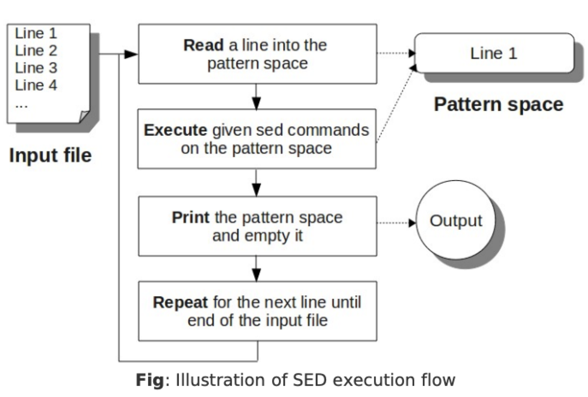

```toc
```

## Flow


## Sed Command Syntax
```bash
sed [options] {sed-commands} {input-file}
```

`-f` to combine multiple sed-commands ina file and call the sed script file
```bash
sed [options] -f {sed-commands-in-a-file} {input-file}
```

`-e` to execute multiple sed commands in command line.
```bash
sed [options] -e {sed-command-1} -e {sed-command-2} {input-file}
```

Execute multiple sed commands in command line using `{}`
```bash
sed [options] '{
sed-command-1
sed-command-2
}' {input-file}
```

> Sed never modifies the original file. Use `>` to redirect output to a file at the end.

## Print Pattern Space (`p` command)
`p` command prints the current pattern space to stdout.
```bash
sed -n 'p' /etc/passwd
```
`-n` to silent output for the read line in each cycle. Without this, every line will be output twice.

Print only the 2nd line:
```bash
sed -n '2 p' employee.txt
```

`,`: Print line 1 through line 4:
```bash
sed -n '1,4 p' employee.txt
```

`$`: represents the last line:
```bash
sed -n '4,$ p' employee.txt
```

`+`: used in conjunction with the comma, to specify a number of lines instead of an absolute line number.
```bash
sed -n '1,+3' emplyee.txt
```

`~`: step
```bash
sed -n '1~2 p' emplyee.txt # => print line 1, 3, 5, 7...
```

## Pattern Matching
Print lines matching the pattern "Jane":
```bash
sed -n '/Jane/ p' employee.txt
```

Print lines starting from the 1st match of "Jason" UNTIL the 4th line:
```bash
$ sed -n '/Jason/,4 p' employee.txt
102,Jason Smith,IT Manager
103,Raj Reddy,Sysadmin
14,Anand Ram,Developer
```
> If there were no matches for "Jason" in the 1st 4 lines, this command would print the lines that match "Jason" after the 4th line.

Print lines starting from the line matching "Raj" until the line matching "Jane"
```bash
sed -n '/Raj/,/Jane/ p' employee.txt
```

## Delete Lines (`d` command)
> Conceptional similar to `p` command, pattern matching then DON'T output the matching line(s)

Delete all the empty lines from a file:
```bash
sed '/^$/ d' employee.txt
```

Delete all comment lines(assuming the comment starts with #)
```bash
sed '/^#/ d' employee.txt
```

## Write Pattern Spae to File (`w` command)
Write the content of employee.txt file to file output.txt (and display on screen, `-n` option can disable the screen printing).
```bash
sed 'w output.txt' employee.txt
```

With pattern matching:
```bash
sed '1,4 w output.txt' employee.txt
```

> `>` can be a replacement of this `w` command
